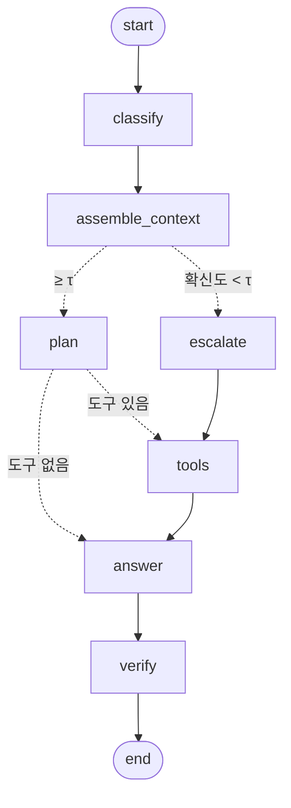

# 택배중계 고객센터 에이전트

고객 문의 하나를 받아 **카테고리를 판정하고 → 그 카테고리의 근거만 모아 → 필요하면 조회 도구를 부르고 → 근거만으로 답하고 → 근거 없는 수치가 섞였는지 검사한다.** 확신이 서지 않으면 답을 지어내지 않고 담당자에게 넘긴다.



구조도는 코드에서 직접 뽑는다: `python -m routing_agent.agent --mermaid x`

> REPORT.md 는 **무엇을 왜 그렇게 만들었고 수치가 얼마인지**를 적는다. 이 문서는 **어떻게 돌리는지**만 적는다.

---

## 환경 요구사항

| 항목 | 실측값 | 비고 |
| --- | --- | --- |
| Python | 3.13.14 | 3.11 이상이면 된다 (`X \| None` 표기 사용) |
| 유료 키 | 없어도 된다 | `claude` / `opencode` / `ollama` 는 키를 쓰지 않는다 |
| 디스크 | 수십 MB | `runs/cache/` 에 LLM 응답을 캐시한다 |

## 이용 방법

```bash
./run.sh check                  # 이 한 줄이면 .venv·설치·.env 까지 알아서 한다
```

손으로 하려면:

```bash
python -m venv .venv && source .venv/bin/activate
pip install -e .                # src-layout 이라 설치해야 routing_agent 를 import 한다
cp .env.example .env            # 쓸 백엔드에 맞춰 채운다 (아래 표)
python scripts/check_context.py # LLM 없이 도는 점검 ①
python -m routing_agent.agent --dry-run "제주도인데 배송비 더 붙나요?"
```

`--dry-run` 은 LLM 을 부르지 않고 **어떤 카테고리로 가서 어떤 근거 절이 프롬프트에 들어가는지**까지만 보여 준다. 키가 하나도 없어도 여기까지는 반드시 돈다. 기록(`store/metrics.jsonl`)도 남기지 않는다 — 구경용 실행이 수치에 섞이면 안 되기 때문이다.

## 백엔드와 재생모드

`AGENT_BACKEND` 하나로 갈아끼운다. 코드는 어느 백엔드인지 모르는 채로 돈다.

| 백엔드 | 키 | 실측 속도 (라우팅 36건) | 설정 |
| --- | --- | --- | --- |
| `openai` | **필요** (`OPENAI_API_KEY`) | 0.2초/건 | 기본값. 기본 모델 `gpt-4o-mini` |
| `claude` | 불필요 (구독 로그인) | 4.7초/건 | `claude --version` 으로 설치 확인. 기본 모델 `haiku`. 사용량 한도가 먼저 걸린다 |
| `opencode` | 불필요 | 33초/건 | 무료 모델만 쓴다. 비용 0, 정확도는 openai 와 큰 차이 없다 |
| `ollama` | 불필요 (로컬) | 70초/건 (9B) | **3B 는 구조화 출력을 못 낸다** — `AGENT_MODEL_OLLAMA=qwen3.5:9b` 처럼 9B 이상 |
| `replay` | 불필요 | 즉시 | `data/demo_cache.json` 에 녹화된 응답만 돌려준다 |

백엔드별 정확도 비교는 REPORT §4 에 있다. 요점은 **유료가 유일한 선택지가 아니라는 것** — 무료 opencode 가 0.861, 유료 openai 가 0.889 이고, 차이는 정확도보다 시간에서 난다.

**키가 하나도 없을 때** — `replay` 로 돌린다. 녹화된 응답을 프롬프트 해시로 되돌려 주는 모드이고, **진짜 모델 호출이 아니다.** 녹화에 없는 질문에는 답하지 못한다. replay 로 돌았다는 사실은 로그·화면·`store/metrics.jsonl` 에 모두 드러난다 — 조용히 다른 모드로 돌지 않는다.

녹화본(`data/demo_cache.json`)은 **정식 런을 녹음해서** 만든다. 사람이 쓴 모범답안이 아니라 실제로 일어난 호출의 사본이다.

```bash
AGENT_RECORD_REPLAY=1 python -m routing_agent.agent --backend claude "편의점택배 접수하면 언제 수거해 가나요?"
python -m routing_agent.agent --backend replay "편의점택배 접수하면 언제 수거해 가나요?"   # 키 없이 같은 경로로
```

녹음은 CLI 백엔드(`claude`·`opencode`)에서만 걸린다. `openai`·`ollama` 는 CLI 를 지나지 않기 때문이다.

요청한 백엔드를 쓸 수 없으면 `replay` 로 떨어지고, 그 사유를 한 줄 출력한다. 파이프라인 안에서도 마찬가지다: 판정이 실패하면 규칙 기반으로, 답변이 실패하면 이관 문구로 떨어지되 **폴백으로 돌았다는 사실을 결과에 남긴다**(`fallback`, `fallback_error`).

## 점검 항목

앞 단계가 통과해야 뒤 수치를 믿는다.

```bash
python scripts/check_context.py          # ① 카테고리별 근거 절 매핑·크기·겹침
python scripts/check_mockdb.py           # ② 조회 도구가 무엇을 돌려주는가 (이름 해석·구간·할증)
python scripts/check_grader.py           # ③ 모범 답안이 채점기에서 전부 만점인가
python -m routing_agent.agent --dry-run "문의"      # ④ LLM 없이 앞단
python -m routing_agent.llm_backends --smoke --backend all   # ⑤ 백엔드가 같은 구조로 답하는가
```

①~③ 이 통과하기 전의 성능 수치는 믿지 않는다. ③ 이 떨어지면 에이전트가 아니라 **채점기나 정답셋이 틀린 것이다.**

## 평가 점검

```bash
python -m routing_agent.evaluate --task routing --backend claude --name routing_v3 \
    --round "#3" --target "prompts.py route_guide" \
    --why "후속 턴이 앞 대화를 못 봐서 오분류" --what "classify 에 history 주입" \
    --memo "C-011#6 해결, C-003#2 남음"

python -m routing_agent.evaluate --task answer --backend claude --judge-backend claude --name answer_v3
python scripts/report_table.py           # 회차별 종합 기록표 (REPORT.md 에 붙인다)
```

`--round` 부터의 다섯 옵션은 **왜·무엇을 바꿨는지를 수치와 같은 줄에 남긴다.** 나중에 손으로 표를 쓰면 수치와 설명이 따로 놀기 때문에, `store/metrics.jsonl` 한 벌만 진실로 둔다.

## 데모 실행

```bash
streamlit run app.py
```

사이드바에서 백엔드·모델·확신도 임계값 τ 를 고른다. 본문은 답변만 보여 주지 않고 **프롬프트에 실제로 들어간 근거 절, 호출한 도구와 인자, 도구 결과, 가드레일 판정**을 함께 펼친다. 폴백으로 돌았으면 상단에 배지가 뜬다.

**채팅 화면이다.** 이전 턴이 화면에 남고 다음 판정의 이력으로 들어가므로, 같은 사안을 반복해 물으면 §10.2 의 반복 문의 이관 기준이 실제로 걸린다. 입력창은 아래에 고정되고 새 답변만 아래에 붙는다 — 폼이 아니라서 화면이 통째로 새로 그려지거나 입력이 사라지지 않는다. 처음부터 다시 하려면 입력칸 오른쪽의 🔄 를 누른다.

## 운영 — 약관·정책이 바뀌거나 택배사가 늘면

이 에이전트는 **근거 문서와 목데이터가 전부**다. 모델을 다시 학습시키거나 프롬프트를 다시 쓰는 일은 대부분 필요 없다. 바뀐 종류별로 손볼 곳은 다음과 같다.

| 바뀐 것 | 손볼 곳 | 코드 수정 | 확인 |
| --- | --- | --- | --- |
| **택배사·편의점 브랜드 추가/삭제** | `data/mockdata_courierhub.json` 의 `carriers.<그룹>` | 불필요 | `./run.sh check` — 새 이름이 구간·조회 검사에 나온다 |
| **운임 금액·구간 변경** | 같은 파일의 해당 `tiers`, 그리고 매뉴얼 §4 운임 스냅샷 표 | 불필요 | `./run.sh check` 뒤 평가 재측정 |
| **지역 추가운임 변경** | 같은 파일의 `region_surcharge` | 불필요 | 〃 |
| **정책 문구·절차 변경** (예: 취소 기준, 반입 제한) | `docs/policy_courierhub.md` 의 해당 절 | 불필요 | `python scripts/check_context.py` |
| **매뉴얼에 절이 추가/삭제/번호 변경** | 위 문서 + `src/routing_agent/context.py` 의 `ROUTE_SECTIONS`·`ALWAYS` 선택자 | **필요** | `check_context.py` 가 없는 절을 선택자로 쓰면 바로 실패한다 |
| **업무 카테고리 자체가 늘거나 줄음** | `src/routing_agent/schemas.py`(라우트 목록) · `src/routing_agent/prompts.py`(분류 지침) · `src/routing_agent/context.py` · `src/routing_agent/tools.py`(`ROUTE_TOOLS`) · 평가셋 | **필요** | 라우팅 평가부터 다시 |
| **새로운 조회 항목** (예: 픽업 가능 시간대) | `src/routing_agent/mockdb.py` 에 함수 + `src/routing_agent/tools.py` 에 `@tool` 래퍼 + `ROUTE_TOOLS` | **필요** | `check_mockdb.py` 에 픽스처 추가 |

**택배사 이름은 코드에 적지 않는다.** 도구 설명(모델이 읽는 문서)에 붙는 이름 목록은 `src/routing_agent/tools.py` 의 `_fill_names()` 가 목데이터에서 읽어 채운다. 데이터에는 있는데 도구 설명에는 없는 상태가 생기면 모델은 그 택배사를 영영 못 부르기 때문이다.

**정책이 바뀌면 수치도 다시 잰다.** 운임이 바뀌면 정답셋의 필수 사실(`data/answer_goldenset.json` 의 `must`)에 박힌 금액도 같이 바뀌어야 한다. 순서는 이렇다.

```bash
# 1. 데이터·문서를 고친다
# 2. LLM 없이 도는 검사부터
./run.sh check
# 3. 정답셋의 금액이 옛 값이면 여기서 걸린다 (모범 답안이 떨어진다)
#    → 정답셋을 고치고, 고친 근거를 커밋 메시지에 남긴다
# 4. 두 지표를 다시 재고 기록에 한 줄 남긴다
python -m routing_agent.evaluate --task answer --backend openai --name answer_2026Q4 \
    --round "#정책개정" --why "운임 개정 반영" --what "mockdata 4.1 구간 갱신"
```

`store/metrics.jsonl` 은 지우지 않고 쌓으므로, 개정 전후 수치가 한 표에 남는다(`./run.sh table`).

## 막힐 때는 이렇게

| 증상 | 1순위 원인 |
| --- | --- |
| `claude 오류: You've hit your session limit` | 구독 사용량 한도. 시간이 지나야 풀린다. 그 사이 수치는 **폴백에 오염되므로 무효 처리**한다 |
| 분류가 전부 한 카테고리로 쏠린다 | 작은 로컬 모델이 구조화 출력에 실패해 규칙 폴백으로 떨어진 것. 화면의 `⚠️ 폴백` 배지를 본다 |
| 도구 호출이 0건 | 카테고리가 틀렸을 가능성이 먼저다. 카테고리마다 부를 수 있는 도구가 다르다 (`tool_menu`) |
| `opencode` 가 멈춰 있다 | 첫 줄 시한 90초. 전역 SQLite 를 공유하므로 동시 실행을 2 이하로 둔다 |
| replay 가 답하지 못한다 | 녹화에 없는 질문이다. 녹화는 정식 런에서만 쌓인다 |
| Streamlit 화면이 비어 있다 | 실행 버튼을 누르기 전에는 입력만 보인다 (`st.stop()`) |

## 폴더 규칙

`src/` 와 `scripts/` 를 가르는 기준은 하나다 — **누가 이 코드를 부르는가.**

| | 부르는 주체 | 지우면 |
| --- | --- | --- |
| `src/routing_agent/` | 다른 코드가 `import` 한다 | 에이전트가 사라진다 |
| `scripts/` | 사람이 터미널에서 실행한다 | 에이전트는 그대로 돈다 (검증·데이터 준비·리포트 생성) |

둘 다 해당하면(예: `agent.py` 는 import 되기도 하고 `python -m routing_agent.agent` 로 돌기도 한다) **패키지에 두고 `__main__` 을 붙인다.** 실행된다는 이유만으로 `scripts/` 로 보내지 않는다.

배치는 파이썬 쪽 요즘 권장인 **src-layout** 이다. 패키지가 `src/` 아래에만 있으면, 저장소 루트에서 실행할 때 설치되지 않은 소스가 우연히 import 되는 일이 없다 — "설치된 것"과 "작업 중인 것"이 갈리지 않는다. 그래서 `pip install -e .` 가 필요하고, `run.sh` 가 그것까지 대신 해 준다.

의존성은 `pyproject.toml` 한 곳에만 적는다. `requirements.txt` 는 `-e .` 한 줄짜리 통로다 — 두 군데 적으면 반드시 어긋난다.

## 구조표

| 파일 | 하는 일 |
| --- | --- |
| `src/routing_agent/llm_backends.py` | 백엔드 5종을 하나의 인터페이스로. CLI 백엔드에 구조화 출력을 얹는다 |
| `src/routing_agent/llm_cache.py` | 프롬프트 해시 파일 캐시. 재채점 때 API 를 다시 부르지 않는다 |
| `src/routing_agent/prompts.py` | 분류 지침·예시, 계획/답변 프롬프트, 규칙 기반 폴백 분류 |
| `src/routing_agent/context.py` | 매뉴얼을 절 단위로 쪼개고 카테고리별로 고를 절을 정한다 |
| `src/routing_agent/mockdb.py` · `src/routing_agent/tools.py` | 조회 로직과 그 LangChain 도구 래퍼 |
| `src/routing_agent/agent.py` | LangGraph 파이프라인 6단계 + CLI |
| `src/routing_agent/guardrail.py` | 근거에 없는 수치가 답변에 섞였는지 기계적으로 검사 |
| `src/routing_agent/grader.py` · `src/routing_agent/evaluate.py` | 두 지표 채점과 평가 실행기 |
| `src/routing_agent/record.py` | `store/metrics.jsonl` 에 1줄 1레코드로 덧붙인다 |
| `scripts/check_*.py` | LLM 없이 도는 픽스처 검증 (근거 매핑 · 조회 도구 · 채점기) |
| `scripts/report_table.py` | 그 기록에서 회차별 종합 기록표를 뽑는다 |
| `scripts/add_navigation_inquiries.py` · `build_eval_set.py` | 원천 문의를 더하고 카테고리 균등 평가셋을 다시 뽑는다 |
| `app.py` | Streamlit 데모 |
| `run.sh` | 사람이 쓰는 단일 창구 (demo/check/ask/dry/eval/table) |
| `pyproject.toml` | 패키지 정의와 의존성 — 의존성의 유일한 출처 |
