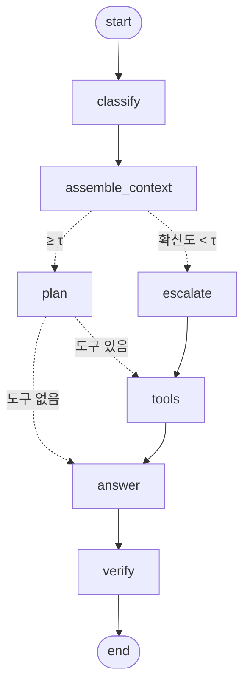

# 택배중계 고객응대 라우팅 에이전트 — 리포트

> **수치는 실측만 쓴다. 추정치는 쓰지 않는다.**
> 이 문서의 모든 숫자는 아래 파일에서 나온다. 손으로 옮겨 적은 수치는 없다.
>
> | 근거 파일 | 무엇이 들어 있나 |
> | --- | --- |
> | `store/metrics.jsonl` | 실행·평가 기록. 1줄 1레코드, 시간순 append. 지우지 않는다 |
> | `runs/*.json` | 평가 원본 (턴별 답변·호출 도구·채점 결과). 재채점은 여기서 한다 |
> | `runs/cache/` | LLM 응답 캐시. 재실행이 같은 답을 보게 한다 |
> | `data/` | 평가셋·정답셋·목데이터 |
> | `docs/policy_courierhub.md` | 근거 문서 (정책 매뉴얼) |
>
> 사람이 정한 값(확신도 임계값 τ, 프롬프트 예시 개수 등)은 **측정치가 아니라 초기 휴리스틱**이다. 해당 절에 그렇게 밝혀 둔다.

## 명세 대응표

과제가 준 디렉토리 예시와 실물 파일의 대응이다.

| 과제 예시 | 실물 | 다르게 한 이유 |
| --- | --- | --- |
| `prompts.py` | `src/prompts.py` | 같다 |
| `context.py` | `src/context.py` | 같다 |
| `agent.py` | `src/agent.py` | 같다 |
| `tools.py` | `src/mockdb.py` + `src/tools.py` | 조회 로직과 LangChain 래퍼를 갈랐다. 도구 목록이 바뀌어도 조회 로직은 그대로 두려고 |
| (없음) | `src/llm_backends.py`, `src/llm_cache.py` | 백엔드 5종을 한 인터페이스로. 크레딧이 떨어져도 과제가 멈추지 않게 |
| (없음) | `src/guardrail.py` | ④ 검증 단계를 LLM 없이 기계적으로 하는 부분 |
| (없음) | `src/grader.py`, `src/evaluate.py`, `src/record.py` | 두 지표 채점과 실행 기록 |
| (없음) | `scripts/check_*.py` | LLM 없이 도는 자체 검증 |

---

## 1. 주제와 근거 문서

<!-- TODO: 왜 택배중계인가, 합성 데이터임을 명시(운임 스냅샷만 실제) -->

## 2. 카테고리 설계

원본 데이터셋은 7개 업무 + OTHER = 8개였다. 과제 요구("3~5개 + 범위 밖 1개")에 맞춰 **5 + OTHER** 로 합쳤다. 병합 기준은 "근거 문서의 어느 절을 읽어야 하는가"다 — 다음 단계(근거 조립)와 직결되기 때문이다.

| 카테고리 | 원본 | 병합 근거 |
| --- | --- | --- |
| `RESERVE_GENERAL` | RESERVE_GENERAL | 서비스가 아직 안 정해진 단계. 예약 방법 공통 |
| `VISIT_PICKUP` | VISIT_PICKUP | 방문택배 — 택배사별 운임표가 따로 있다 |
| `CVS_PICKUP` | CVS_PICKUP | 편의점택배 — 브랜드별 운임표가 따로 있다 |
| `BIZ_BULK` | BULK_DISCOUNT + BIZ_ACCOUNT + ORDER_SYNC | 셋 다 사업자·대량 발송 계열. 운임 4.2/4.4 와 8~9장을 함께 읽어야 답이 나온다 |
| `SPEC_SHIPPING` | SPEC_SHIPPING | 규격·배송조회·취소·반입제한 — 서비스 종류와 무관한 공통 문의 |
| `OTHER` | OTHER | 응대 범위 밖 |

원본 컬럼(`route_original`)은 남겨 두었다. 병합이 맞았는지 되짚을 수 있어야 하기 때문이다.

### 카테고리 → 근거 절 매핑 (실측)

`python scripts/check_context.py` 가 42개 항목을 검사하고 전부 통과한다.

| 카테고리 | 절 수 | 고유 절 수 | 글자 수 | 고유 절 |
| --- | --- | --- | --- | --- |
| RESERVE_GENERAL | 11 | 4 | 2,870 | 1, 1.1, 1.2, 2 |
| VISIT_PICKUP | 12 | 5 | 3,205 | 1, 1.1, 2, 4, 4.1 |
| CVS_PICKUP | 13 | 6 | 3,236 | 1, 1.1, 2, 4, 4.3, 5.3 |
| BIZ_BULK | 16 | 9 | 3,296 | 1, 1.2, 4, 4.2, 4.4, 8.1~8.3, 9 |
| SPEC_SHIPPING | 13 | 6 | 2,627 | 3.1, 3.2, 5.1, 5.2, 6, 7 |
| OTHER | 9 | 2 | 2,291 | 10.1, 10.2 |

매뉴얼 전문을 통째로 넣지 않는다. 카테고리마다 **2.3~3.3천 자**만 들어간다. 상담 기본 원칙 3개와 이관 기준은 모든 카테고리에 공통으로 들어간다.

## 3. 평가셋 설계

| 셋 | 크기 | 무엇을 재나 |
| --- | --- | --- |
| `data/eval_set.csv` | 36건 (카테고리당 6건 균등) | 라우팅 분류 정확도·macro F1 |
| `data/answer_goldenset.json` | eval 16대화 / 채점 턴 24개 | 도구 호출 적절성·답변 적절성 |
| (같은 파일) | fewshot 4대화 | 프롬프트 예시 전용. 평가에 쓰지 않는다 |

**예시용과 평가용을 갈랐다.** 프롬프트에 넣은 대화가 평가셋에도 있으면 수치가 부풀려진다. `assert_split_disjoint()` 가 평가 시작 전에 두 집합이 겹치지 않는지 확인한다.

기대 도구와 필수 사실(`must`·`forbid`·`must_ask`)은 정책 매뉴얼의 절 번호를 근거로 정했다. 정답셋이 틀렸다고 판단해 고친 경우는 그 근거를 커밋 메시지에 남긴다 (예: C-004#2 — 다량할인은 택배사가 아니라 박스 수량으로 갈리므로 "택배사를 되물어라"는 기준을 뺐다).

## 4. 측정 결과

<!-- TODO: python scripts/report_table.py 출력을 여기에 붙인다 -->

### 폭주 방지 장치 (실측 근거)

| 장치 | 값 | 근거 |
| --- | --- | --- |
| claude 전체 시한 | 120초 | 실측 10초/건. 12배 여유 |
| opencode 첫 줄 시한 | 90초 | 부트스트랩이 길다. 첫 줄이 안 나오면 멈춰 선 것 |
| opencode 전체 시한 | 300초 | 실측 25초/건 |
| 구조화 출력 재시도 | 2회 | 파싱 실패는 한 번 더 부르면 대개 붙는다. 그 이상은 낭비 |
| 동시 실행 | opencode·ollama 2, claude 3, 그 외 6 | opencode 는 전역 SQLite 를 공유해 경합한다. claude 는 구독 한도가 먼저 걸린다 |
| 확신도 임계값 τ | 0.6 | **측정치가 아니다.** sweep 전의 초기 휴리스틱 |
| stdin | 항상 닫는다 | 열어 두면 opencode 부트스트랩이 거기서 멈춰 선다 |

## 5. 파이프라인 구조도

`python -m src.agent --mermaid x` 의 출력이다 (가독성을 위해 분기 라벨만 붙였다).

**판정과 이관 결정을 갈랐다.** `classify` 는 카테고리와 확신도를 내놓기만 하고, 넘길지 말지는 그다음 파이썬 분기 함수가 임계값으로 정한다. 과제가 요구한 "확신이 없을 때 넘기는 판단"을 LLM 이 스스로 하게 두지 않는다.

<!-- TODO: 상태 흐름표, 폴백 체인 Mermaid -->

## 6. 데모 설계

<!-- TODO: 터미널 캡처(실행 증거) + Streamlit 캡처(결과 증거) -->

## 7. 회고

<!-- TODO: 사용자 판단으로 정한 것 / 구현한 것을 갈라 적는다 -->
