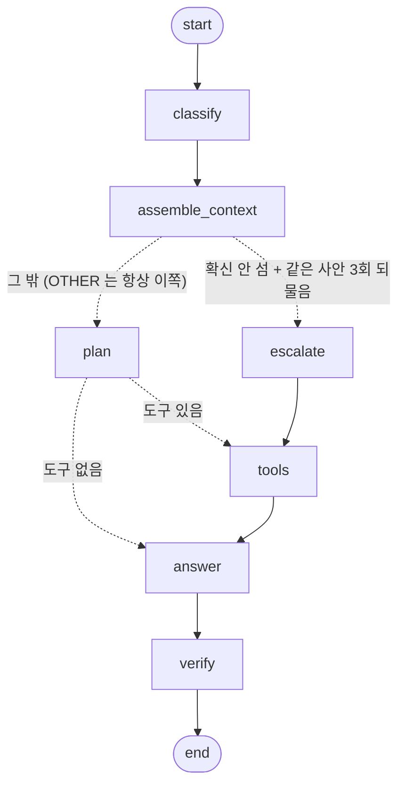
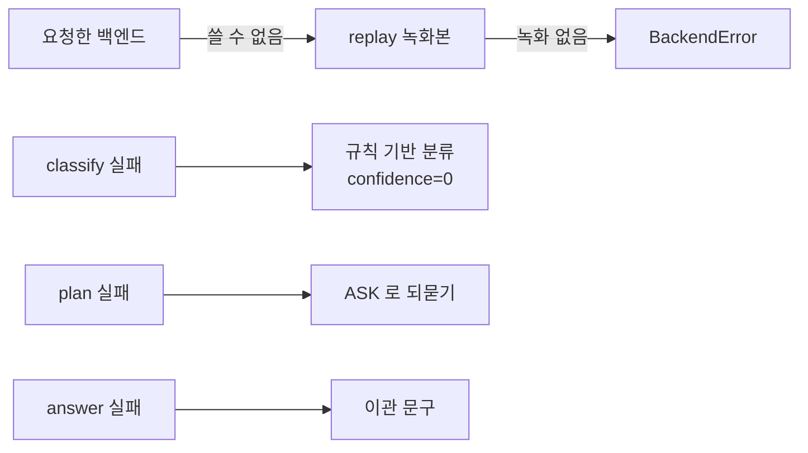
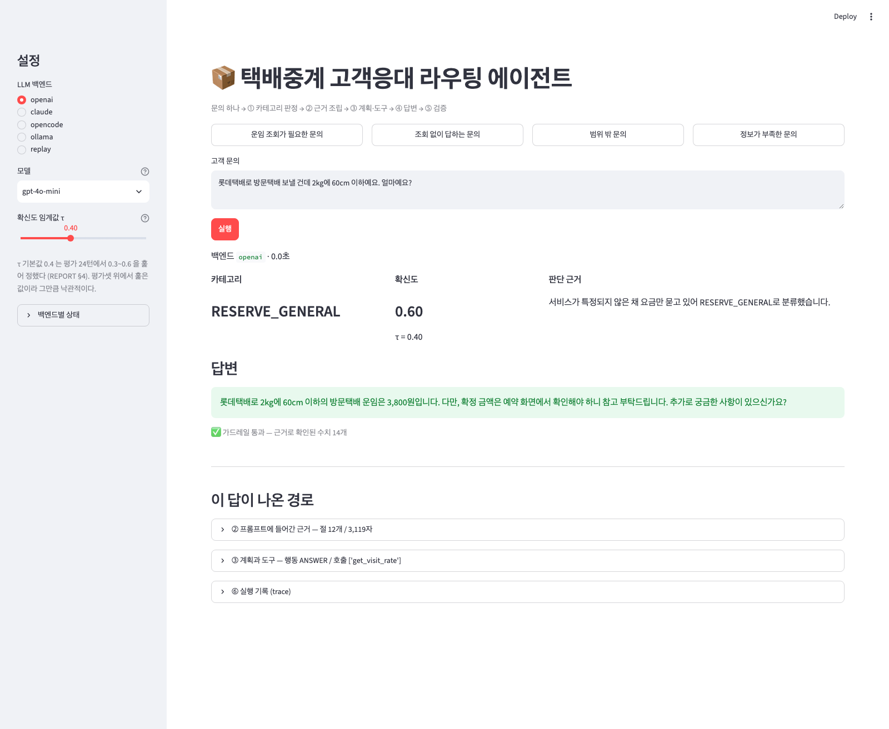
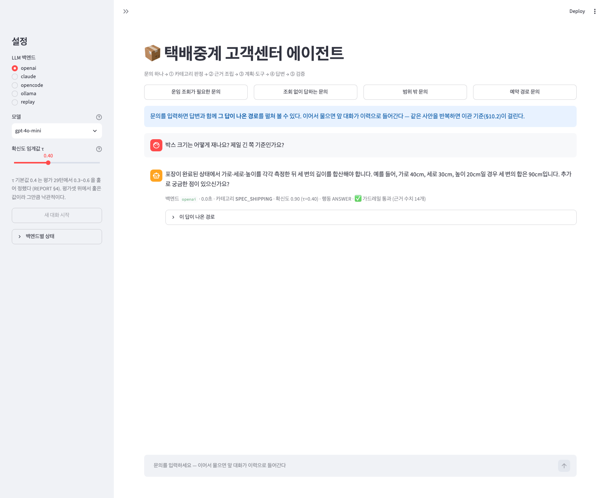
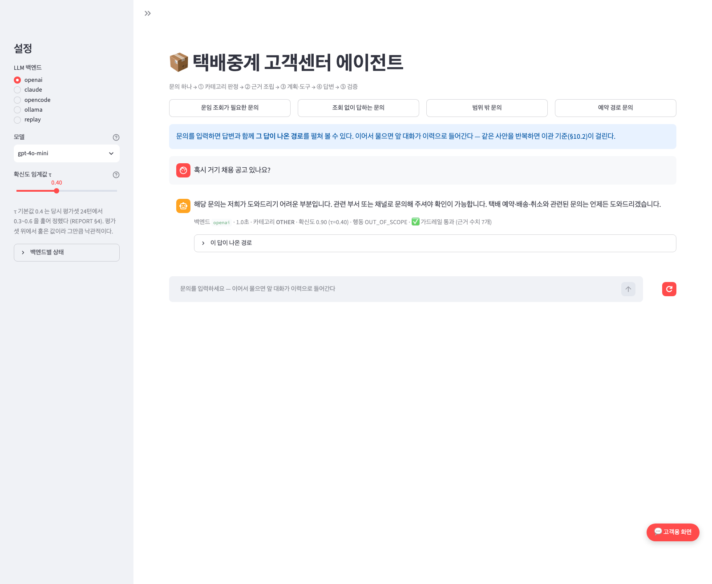
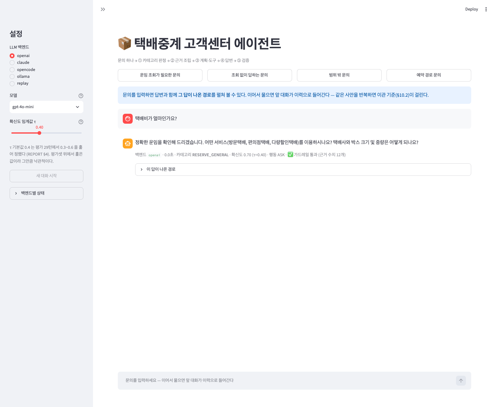

# 택배중계 고객센터 에이전트 — 리포트

> **수치는 실측만 쓴다. 추정치는 쓰지 않는다.**
> 이 문서의 모든 숫자는 아래 파일에서 나온다. 손으로 옮겨 적은 수치는 없다.
>
> | 근거 파일 | 무엇이 들어 있나 |
> | --- | --- |
> | `store/metrics.jsonl` | 실행·평가 기록. 1줄 1레코드, 시간순 append. 지우지 않는다 |
> | `runs/*.json` | 평가 원본 (턴별 답변·호출 도구·채점 결과). 재채점은 여기서 한다 |
> | `runs/cache/` | LLM 응답 캐시. 재실행이 같은 답을 보게 한다 |
> | `data/` | 평가셋·정답셋·목데이터 |
> | `docs/policy_courierhub.md` | 근거 문서 (정책 매뉴얼) |
>
> 사람이 정한 값(확신도 임계값 τ, 프롬프트 예시 개수 등)은 **측정치가 아니라 초기 휴리스틱**이다. 해당 절에 그렇게 밝혀 둔다.

## 명세 대응표

과제가 준 디렉토리 예시와 실물 파일의 대응이다.

| 과제 예시 | 실물 | 다르게 한 이유 |
| --- | --- | --- |
| `prompts.py` | `src/routing_agent/prompts.py` | 같다 |
| `context.py` | `src/routing_agent/context.py` | 같다 |
| `agent.py` | `src/routing_agent/agent.py` | 같다 |
| `tools.py` | `src/routing_agent/mockdb.py` + `src/routing_agent/tools.py` | 조회 로직과 LangChain 래퍼를 갈랐다. 도구 목록이 바뀌어도 조회 로직은 그대로 두려고 |
| (없음) | `src/routing_agent/llm_backends.py`, `src/routing_agent/llm_cache.py` | 백엔드 5종을 한 인터페이스로. 크레딧이 떨어져도 과제가 멈추지 않게 |
| (없음) | `src/routing_agent/guardrail.py` | ④ 검증 단계를 LLM 없이 기계적으로 하는 부분 |
| (없음) | `src/routing_agent/grader.py`, `src/routing_agent/evaluate.py`, `src/routing_agent/record.py` | 두 지표 채점과 실행 기록 |
| (없음) | `scripts/check_*.py` | LLM 없이 도는 자체 검증 (근거 매핑·조회 도구·이관 판단·채점기) |
| (없음) | `pyproject.toml` | 패키지 정의·의존성. 의존성은 여기 한 곳에만 적는다 |

배치는 파이썬 쪽 요즘 권장인 **src-layout** 이다 — 패키지는 `src/routing_agent/` 에만 있고 `pip install -e .` 로 깐다. 저장소 루트에서 실행할 때 설치되지 않은 소스가 우연히 import 되는 일이 없어서, 채점자 환경과 개발 환경이 갈리지 않는다.

`src/` 와 `scripts/` 를 가르는 기준은 **누가 부르는가** 하나다. 다른 코드가 import 하면 패키지, 사람이 터미널에서 실행하면 `scripts/`. 둘 다면 패키지에 두고 `__main__` 을 붙인다 — `agent.py`·`evaluate.py` 가 그렇다. 자세한 것은 README 의 "폴더 규칙".

---

## 1. 주제와 근거 문서

**택배중계 서비스 고객응대**를 골랐다. 이 도메인은 답이 두 곳에서 나온다 — 잘 바뀌지 않는 공통 원칙(규격 측정법, 예약번호와 운송장번호의 차이, 반입 제한)은 **문서**에, 건마다 달라지는 값(운임, 예약·배송 상태)은 **조회**에 있다. 라우팅 에이전트를 재기에 좋은 구조다. "문서만으로 답할 것"과 "반드시 조회할 것"이 카테고리마다 다르게 섞여 있어, 도구 호출 적절성이라는 지표가 실제로 무언가를 잰다.

| 파일 | 무엇 | 크기 |
| --- | --- | --- |
| `docs/policy_courierhub.md` | 정책 매뉴얼 (14장) — 근거 문서 | 15.9KB |
| `data/mockdata_courierhub.json` | 운임표·택배사·규격 규칙·반입 제한 등 조회 대상 | 15KB |
| `data/eval_set.csv` | 라우팅 평가셋 36건 | 카테고리당 6건 |
| `data/answer_goldenset.json` | 멀티턴 정답셋 20대화 (eval 16 / fewshot 4) | 채점 턴 24개 |

**합성 데이터임을 밝힌다.** 매뉴얼은 공개된 택배중계 서비스 FAQ 를 교육용으로 재구성한 가상 문서이고(문서 첫머리에 고지가 박혀 있다), 업체명·서비스명은 쓰지 않았다. 운임 스냅샷만 원본 FAQ 에 공개된 값을 그대로 옮겼으며 실제 예약 시점 값과 다를 수 있다. 매뉴얼 자체가 "운임은 참고 스냅샷이니 확정 금액은 예약 화면에서 확인하라"고 적고 있고, 에이전트의 답변도 그 문장을 따른다.

## 2. 카테고리 설계

원본 데이터셋은 7개 업무 + OTHER = 8개였다. 과제 요구("3~5개 + 범위 밖 1개")에 맞춰 **5 + OTHER** 로 합쳤다. 병합 기준은 "근거 문서의 어느 절을 읽어야 하는가"다 — 다음 단계(근거 조립)와 직결되기 때문이다.

| 카테고리 | 원본 | 병합 근거 |
| --- | --- | --- |
| `RESERVE_GENERAL` | RESERVE_GENERAL | 서비스가 아직 안 정해진 단계. 예약 방법 공통 |
| `VISIT_PICKUP` | VISIT_PICKUP | 방문택배 — 택배사별 운임표가 따로 있다 |
| `CVS_PICKUP` | CVS_PICKUP | 편의점택배 — 브랜드별 운임표가 따로 있다 |
| `BIZ_BULK` | BULK_DISCOUNT + BIZ_ACCOUNT + ORDER_SYNC | 셋 다 사업자·대량 발송 계열. 운임 4.2/4.4 와 8~9장을 함께 읽어야 답이 나온다 |
| `SPEC_SHIPPING` | SPEC_SHIPPING | 규격·배송조회·취소·반입제한 — 서비스 종류와 무관한 공통 문의 |
| `OTHER` | OTHER | 응대 범위 밖 |

원본 컬럼(`route_original`)은 남겨 두었다. 병합이 맞았는지 되짚을 수 있어야 하기 때문이다.

### 카테고리 → 근거 절 매핑 (실측)

`python scripts/check_context.py` 가 42개 항목을 검사하고 전부 통과한다.

| 카테고리 | 절 수 | 고유 절 수 | 글자 수 | 토큰(근사) | 고유 절 |
| --- | --- | --- | --- | --- | --- |
| RESERVE_GENERAL | 12 | 4 | 3,436 | 2,067 | 1, 1.1, 1.2, 2 |
| VISIT_PICKUP | 13 | 5 | 3,771 | 2,287 | 1, 1.1, 2, 4, 4.1 |
| CVS_PICKUP | 14 | 6 | 3,802 | 2,309 | 1, 1.1, 2, 4, 4.3, 5.3 |
| BIZ_BULK | 17 | 9 | 3,545 | 2,243 | 1, 1.2, 4, 4.2, 4.4, 8.1, 8.2, 8.3, 9 |
| SPEC_SHIPPING | 15 | 7 | 3,289 | 2,051 | 3.1, 3.2, 5.1, 5.2, 5.4, 6, 7 |
| OTHER | 9 | 1 | 2,291 | 1,393 | 10.1 |

매뉴얼 전문을 통째로 넣지 않는다. 카테고리마다 **2,291~3,545자**만 들어간다. 상담 기본 원칙 3개와 이관 기준(§10.2)·이관 시 남길 것(§10.3)은 모든 카테고리에 공통으로 들어간다 — 이관은 범위 밖 문의에서만 일어나지 않기 때문이다(#7).

## 3. 평가셋 설계

| 셋 | 크기 | 무엇을 재나 |
| --- | --- | --- |
| `data/eval_set.csv` | 42건 (카테고리당 7건 균등) | 라우팅 분류 정확도·macro F1 |
| `data/answer_goldenset.json` | eval 21대화 / 채점 턴 31개 | 도구 호출 적절성·답변 적절성 |
| (같은 파일) | fewshot 4대화 | 프롬프트 예시 전용. 평가에 쓰지 않는다 |

**예시용과 평가용을 갈랐다.** 프롬프트에 넣은 대화가 평가셋에도 있으면 수치가 부풀려진다. `assert_split_disjoint()` 가 평가 시작 전에 두 집합이 겹치지 않는지 확인한다.

기대 도구와 필수 사실(`must`·`forbid`·`must_ask`)은 정책 매뉴얼의 절 번호를 근거로 정했다. 정답셋이 틀렸다고 판단해 고친 경우는 그 근거를 커밋 메시지에 남긴다 (예: C-004#2 — 다량할인은 택배사가 아니라 박스 수량으로 갈리므로 "택배사를 되물어라"는 기준을 뺐다).

## 4. 측정 결과

### 두 지표

| 지표 | 정의 | 왜 이렇게 |
| --- | --- | --- |
| 도구 호출 적절성 | 실제로 실행된 도구 집합 == 기대 도구 집합이면 1점 | **부분집합이 아니라 정확히 일치**다. 그래야 "필요한 근거를 안 읽은 것", "관련 없는 조회를 한 것", "넘겨야 하는데 지어낸 것"이 이 하나로 다 걸린다 |
| 답변 적절성 | `must` 를 전부 담고 `forbid` 를 하나도 어기지 않으면 1점 | 표현이 아니라 사실을 본다. 문자열로 안 잡히면 LLM 에게 "이 사실이 다른 표현으로 들어 있는가"만 묻는 2단 판정 |

"실제로 호출한 도구"는 계획(plan 이 내놓은 JSON)이 아니라 상태에 쌓인 `ToolMessage` 에서 뽑는다. 계획만 보면 "부르겠다고 해 놓고 못 부른 것"이 성공으로 잡힌다.

### 지금 수치 (gpt-4o-mini, 평가 31턴 / 라우팅 42건)

| | 기준선 (#4) | 지금 (#40) |
| --- | --- | --- |
| **도구 호출 적절성** | 0.750 | **1.000** |
| **답변 적절성** | 0.583 | **0.871** |
| 행동 일치 (진단용) | 0.625 | 0.806 |
| 라우팅 정확도 (단일 턴) | 0.889 (36건) | 0.881 (42건) |
| 폴백 | 0건 | 0건 |
| 가드레일 위반 | 1건 | 0건 |

라우팅은 LLM 없는 규칙 기준선 0.762 대비 0.881 이다(둘 다 42건 기준). "LLM 을 썼으니 좋아졌다"가 아니라 **규칙으로도 얼마까지 되는지**를 먼저 재 두었다.

행동 일치는 과제가 요구한 지표가 아니라 우리가 더 본 진단용 수치다. #18·#23 에서 내려갔는데, 뒤집힌 건들은 모두 **답변 내용은 통과하고 라벨만 흔들린** 것이다(ANSWER→ASK, ASK→CONFIRM, ANSWER→OUT_OF_SCOPE). 프롬프트 문구를 건드리면 이 라벨이 곧잘 흔들린다. 수치를 올리려고 되돌리지 않고 그대로 적는다.

### 개선 시도별 기록표

`store/metrics.jsonl` 에서 `python scripts/report_table.py` 로 뽑는다. 손으로 쓰지 않는다.

| 회차 | 변경 대상 | 핵심 변경 이유 (Why) | 핵심 변경 내용 (What) | 라우팅 (정확도 / macro F1) | 답변 (도구 / 적절성) | 하드케이스 45건 (라우팅 / 되물음) | 성과 및 오답 메모 |
| --- | --- | --- | --- | --- | --- | --- | --- |
| #0 `claude/haiku` | — | — | 기준선: 절 단위 근거, 카테고리별 예시 2개 | 0.778 / 0.768 (36건) | — | — | — |
| #1 `rule` | — | — | 규칙 기준선 (LLM 없음) | 0.694 / 0.699 (36건) | — | — | — |
| #2 `claude/haiku` | — | — | 개선1: BIZ_BULK에 소호 신청·셀러 운영 단서, OTHER에 배송사고 추가 (정책 §1·§10.1 근거) | 0.889 / 0.893 (36건) | — | — | — |
| #3 `claude/haiku` | — | — | 기준선: 계획 JSON 프로토콜, 카테고리별 도구 메뉴 | — | 0.625 / 0.542 (24턴) | — | answer_claude_v1 무효 — 답변 단계 폴백 7건(N-001~N-005)이 전부 claude 구독 사용량 한도('session limit')였다. 에이전트 성능이 아니라 인프라 실패. 한도 해제 후 같은 이름으로 다시 잰다. 레코드는 지우지 않는다. |
| #4 `openai/gpt-4o-mini` | `llm_backends.py make_llm` | openai strict 구조화 출력이 AnswerPlan.args 자유형 dict 를 거부해 plan 이 전부 폴백 | openai 계열은 with_structured_output 을 function_calling 으로 호출하도록 백엔드 계층에서 흡수 | 0.889 / 0.888 (36건) | 0.750 / 0.583 (24턴) | — | 백엔드 비교용 openai 기준선 (모델 gpt-4o-mini) openai 답변 기준선. 판정기 LLM 없음(문자열 매칭만) — 크레딧 절약 |
| #5 `openai/gpt-4o-mini` | `agent.py gate` | 확신도 미달이면 OTHER 까지 이관돼 범위 밖 문의가 2차 상담에 쌓였다. 정책 §10.2 이관 조건에 '확신도 낮음'은 없고 §10.1 은 채널 안내로 끝내라고 한다 | 게이트에서 route==OTHER 는 확신도와 무관하게 plan 으로 보낸다 | — | 0.792 / 0.625 (24턴) | — | 직전 회차 불필요_조회 5건 중 OTHER 2건이 대상 |
| #6 `openai/gpt-4o-mini` | `agent.py classify` | 후속 턴이 앞 대화를 못 봐서 오분류 ('다시 해봐도 그대로예요' 는 이력 없이는 뜻이 없다) | classify 프롬프트에 [이전 대화] 를 넣는다 | — | 0.792 / 0.583 (24턴) | — | 직전 회차 라우팅 오분류 6건 중 후속 턴 2건이 대상 |
| #7 `openai/gpt-4o-mini` | `context.py ALWAYS` | 2차 상담 이관 기준(§10.2)이 OTHER 카테고리에만 들어가 업무 카테고리의 계획 단계가 이관 여부를 판단할 근거가 없었다 | §10.2 를 모든 카테고리 공통 절로 옮긴다 | — | 0.875 / 0.625 (24턴) | — | C-011#6(반복 문의) 대상. 직전 회차에서 카테고리를 맞히자 ASK 로 갔던 턴 |
| #8 | `agent.py DEFAULT_THRESHOLD` | τ=0.6 은 측정치가 아니라 초기 휴리스틱이었고, 첫 문의 3건이 그 문턱에 걸려 이관됐다 | τ sweep(0.3/0.4/0.5/0.6) 후 0.4 로 확정. 0.3 과 동률이라 보수적인 쪽 | — | openai/gpt-4o-mini 1.000 / 0.667 (24턴) openai/gpt-4o-mini 1.000 / 0.667 (24턴) openai/gpt-4o-mini 0.917 / 0.625 (24턴) openai/gpt-4o-mini 1.000 / 0.667 (24턴) | — | τ=0.3 τ=0.4 τ=0.5 도구 0.875→1.000 · 행동 0.750→0.833. 평가셋 위에서 훑은 값이라 낙관적일 수 있음(REPORT 고지) |
| #9 `openai/gpt-4o-mini` | `guardrail.py check_guardrail` | 고객이 직접 말한 예약번호(R-90410)를 되읽어 준 것을 '근거 없는 수치'로 잡는 오탐 | 고객 발화(이번 문의 + 이전 대화)도 근거 출처에 포함한다 | — | 1.000 / 0.667 (24턴) | — | 가드레일 위반 1건이 오탐이었다 |
| #10 `openai/gpt-4o-mini` | `평가 방식` | 과제 기준은 '표현이 아니라 사실'인데 문자열 매칭만 쓰면 다른 표현으로 담긴 사실을 누락으로 센다 | LLM 판정기(gpt-4o-mini)를 2단으로 붙인다 — 문자열로 잡히면 통과, 안 잡히면 LLM 에게 사실 포함 여부만 묻는다 | — | 1.000 / 0.667 (24턴) | — | 코드 변경 없음. 측정 방식만 바뀐 회차 |
| #11 `openai/gpt-4o-mini` | `prompts.py ANSWER_RULES · ACTION_HINTS` | 근거에 있는 조건·절차를 안내하지 않고 곧장 되물어 필수 사실이 빠졌다 (4건) | '안내가 먼저, 되묻기는 그다음' 규칙 추가. ASK·OUT_OF_SCOPE 힌트도 같은 취지로 | — | 1.000 / 0.708 (24턴) | — | C-005#2·C-011#4·C-013#2·N-005#2 대상 |
| #12 `openai/gpt-4o-mini` | `grader.py forbid 판정` | 금지 내용을 부정·정정한 문장까지 위반으로 잡는 오탐 (N-004#2 '제일 긴 쪽 기준이 아니라') | forbid 도 must 처럼 2단 판정 — 문자열로 잡히면 LLM 에게 '사실로 주장하는가'를 묻는다 | — | 1.000 / 0.750 (24턴) | — | 채점기 수정. 자체 검증(모범답안 30턴) 통과 확인 후 재측정 |
| #13 | `백엔드 비교` | 백엔드가 바뀌어도 같은 경로로 도는지, 수치가 얼마나 벌어지는지 봐야 한다 | 같은 라우팅 평가셋 36건을 백엔드별로 돌린다 | ollama/qwen2.5:3b 0.000 / 0.000 (36건) ollama/qwen3.5:9b 0.778 / 0.865 (36건) opencode/nemotron-3.5-lightning-free 0.861 / 0.861 (36건) | — | — | ollama qwen2.5:3b (로컬) ollama qwen3.5:9b (로컬, 26.6초/건). qwen2.5:3b 는 구조화 출력을 아예 못 내 0건 opencode nemotron-3.5-lightning-free (무료, 약 47초/건) |
| #14 `openai/gpt-4o-mini` | `mockdb.py _rate 이름 해석` | 고객은 'CU','롯데'처럼 줄여 말하는데 정확한 상품명만 받아 조회가 통째로 실패했다 — 값을 쥐고도 '등록된 이름이 아니다'만 안내 | 부분 일치 후보를 요금과 함께 돌려준다. 하나면 그대로 쓰고, 여럿이면 상품별 운임을 ambiguous 로 함께 준다 | — | 1.000 / 0.792 (24턴) | — | N-003#4(CU) 대상 |
| #15 `openai/gpt-4o-mini` | `context.py build_context` | 문서 순서대로 쌓으면 상담 기본 원칙이 앞을 차지하고 이번 문의의 핵심 근거(§8 연동 점검, §4.4 운임 구조)가 뒤로 밀려 답변에서 빠진다 | 카테고리 고유 절을 앞에, 공통 절을 뒤에 두고 두 덩어리에 이름을 붙인다 | — | 1.000 / 0.750 (24턴) | — | 남은 5건이 전부 근거 일부 누락이었다 #15(근거 조립 순서 바꾸기) 되돌림. 카테고리 고유 절을 앞으로 올려도 목표였던 '근거 일부 누락' 5건은 그대로였고 답변 0.792→0.750 · 행동 0.833→0.750 으로 내려갔다. 뒤집힌 3건은 모두 행동 판정이 흔들린 것(ASK→CONFIRM/ANSWER)이라 의도한 효과가 아니다. 코드는 되돌리고 runs/answer_openai_v11.json 은 근거로 남긴다. |
| #16 `openai/gpt-4o-mini` | `prompts.py ANSWER_RULES 문장 규칙` | '1~3문장' 제약 때문에 근거의 조건 일부를 빼고 답하는 것으로 보였다 (남은 5건이 전부 조건 누락) | 문장 수보다 조건을 우선하도록 문장 규칙을 고친다 | — | 1.000 / 0.750 (24턴) | — | C-011#2·C-011#4·N-005#2·C-005#2 대상 #16(답변 문장 수 제약 완화) 되돌림. '1~3문장' 때문에 조건을 뺀다고 봤지만 완화해도 답변 0.792→0.750 으로 내려갔다. 길이가 원인이 아니라는 뜻이다. #15 에 이어 두 번째 실패한 가설 — 남은 5건은 '무엇을 담아야 하는지'를 카테고리별로 더 구체적으로 줘야 풀릴 것으로 보인다. |
| #17 `openai/gpt-4o-mini` | `prompts.py ANSWER_RULES` | 매뉴얼의 번호 매긴 점검 절차(§8.1·§8.2)를 한 문장으로 뭉개 조건이 빠졌다. 정답셋의 must 는 전부 매뉴얼에 직접 근거가 있어 기준이 과한 것이 아니다 | 번호 매겨진 점검 절차는 항목과 조건을 살려 순서대로 안내하라는 규칙 추가 (문서 구조에 근거, 특정 문항에 맞춘 것이 아님) | — | 1.000 / 0.833 (24턴) | — | C-005#2·C-011#2·C-011#4·N-005#2 대상 |
| #18 `openai/gpt-4o-mini` | `prompts.py PLAN_RULES` | 서비스가 안 정해졌는데 택배사·크기만 되물어 어느 운임표를 볼지 여전히 미정이었다 (2건) | 서비스가 미정이면 그것부터 묻게 한다 — 운임표도 조회 도구도 서비스별로 갈린다는 근거를 명시 | — | 1.000 / 0.875 (24턴) | — | C-001#2·N-001#2 대상 |
| #19 `openai/gpt-4o-mini` | `prompts.py route_guide` | 후속 발화('그대로예요')가 새 문의로 취급돼 OTHER 로 샜다. 그러면 같은 사안을 몇 번 물었는지 알 수 없어 반복 문의 이관(§10.2)이 성립하지 않는다 | 이전 대화가 있으면 그 사안의 카테고리를 잇도록 분류 지침에 규칙 추가 | — | 1.000 / 0.875 (24턴) | — | 데모를 멀티턴으로 고치다가 드러난 결함 |
| #20 `openai/gpt-4o-mini` | `agent.py conversation_progress · prompts.py plan_prompt` | 반복 문의 이관(§10.2)을 LLM 이 이력을 훑어 세고 있었다. 세는 일이 틀리면 기준 자체가 무너진다 | 파이썬이 '고객 N번째 발화 · 안내 M회'를 세어 계획 단계에 사실로 넘긴다. 적용 여부는 LLM 이 판단 | — | 1.000 / 0.875 (24턴) | — | 판정은 LLM, 셈과 임계값은 파이썬이라는 이 프로젝트의 분리 원칙에 맞춘다 |
| #21 `openai/gpt-4o-mini` | `docs/policy_courierhub.md §2·§5.4 · context.py · prompts.py · 정답셋` | 예약·배송조회를 '어디서 하는가' 묻는 문의가 실제로 많은데 매뉴얼에도 정답셋에도 없었다 | 매뉴얼에 예약 경로(§2)와 예약내역·배송조회 경로+3개월 보관(§5.4)을 넣고, 정답셋에 4대화(5턴) 추가 | — | 1.000 / 0.897 (29턴) | — | 채점 턴 24 → 29개로 늘었다. 이전 회차와 분모가 다르다 |
| #22 | `data/eval_set.csv` | 경로 문의(어디서 하는가)가 평가셋에 없었고, OTHER 가 6건뿐이라 카테고리당 7건을 뽑을 수 없었다 | 경로 문의 4건 + 범위 밖 행정 문의 1건을 원천에 더하고 카테고리당 7건(42건)으로 다시 뽑는다 | rule 0.762 / 0.770 (42건) openai/gpt-4o-mini 0.857 / 0.856 (42건) | — | — | 규칙 기준선 (42건 기준으로 다시) openai gpt-4o-mini (42건 기준) |
| #23 | `agent.py conversation_progress · prompts.py PLAN_RULES · app.py` | 턴이 이어진 것을 같은 사안 반복으로 세어, 다른 것을 물었는데도 '반복 문의'로 이관했다 | 이번 턴과 같은 카테고리인 지난 발화만 센다. 이력 항목에 그때의 카테고리를 함께 싣고, 계획 규칙에도 '대화가 길다는 것은 반복이 아니다'를 명시 | — | openai/gpt-4o-mini 1.000 / 0.897 (29턴) openai/gpt-4o-mini 1.000 / 0.897 (29턴) | — | 화면에서 재현된 오작동: 편의점 접수 문의 뒤 '방문택배 내일 오나요?' 가 반복 문의로 이관됐다 정답셋 이력에도 카테고리를 실어 셈이 켜지게 한 뒤 재측정 |
| #24 | `mockdb.py note · prompts.py ANSWER_RULES` | 도구 결과의 '매뉴얼 스냅샷 값' 이 고객 답변에 그대로 실려 나갔다. 고객이 알아듣지 못하는 내부 용어다 | 도구 문구를 '기본 운임 기준 금액' 으로 바꾸고, 내부 용어를 고객에게 옮기지 말라는 규칙을 답변 규칙에 넣는다 | — | openai/gpt-4o-mini 1.000 / 0.828 (29턴) openai/gpt-4o-mini 1.000 / 0.862 (29턴) openai/gpt-4o-mini 1.000 / 0.897 (29턴) | — | 화면에서 지적된 표현. '매뉴얼 스냅샷 값으로' → '기본 운임' 규칙을 '낱말만 바꾼다'로 좁혀 재측정 — 첫 문구는 조건까지 지워 0.897→0.828 로 내려갔다 자료를 가리키는 말만 금지하고 서비스 용어(수집·집하·연동)는 유지하도록 다듬어 재측정 |
| #25 `openai/gpt-4o-mini` | `agent.py gate` | 확신도가 낮다는 이유만으로 첫 문의를 이관했다. '얼마에요?' 한 마디에 담당자를 부르면 되물음 한 번이면 끝날 일에 고객이 상담원을 기다린다 | 같은 사안을 이미 되물었는데도 확신이 안 서면 그때 이관한다. 처음이면 계획 단계로 보내 되묻게 한다 | — | 1.000 / 0.897 (29턴) | — | 화면에서 재현: '얼마에요?' → 전 ESCALATE, 후 ASK |
| #26 `openai/gpt-4o-mini` | `agent.py should_escalate · ASK_LIMIT · scripts/check_policy.py` | 되묻기를 한 번만 하고 넘기면 상담이 성급하다. 정책 §10.2 는 동일 사안 3회 이상을 이관 조건으로 둔다 | 같은 사안 3회까지 되묻고 그 뒤에 이관한다. 게이트 판단을 순수 함수로 꺼내 LLM 없이 검증한다 | — | 1.000 / 0.897 (29턴) | — | 사용자 지시: 3회까지 되묻고 이관 |
| #27 | `schemas.py ACTIONS · prompts.py · 정답셋` | '추가로 궁금한 점 있으신가요?' 에 '없어요' 라고 답하자 이관했다. 종료를 나타낼 행동이 아예 없어 그 턴이 갈 곳이 없었다 | 행동에 CLOSE 를 더하고, 종료 턴에는 근거 문서를 넣지 않는다(넣으면 인사만 할 자리에 점검 절차를 쏟는다). 정답셋에 종료 대화 1건 추가 | — | openai/gpt-4o-mini 1.000 / 0.871 (31턴) openai/gpt-4o-mini 1.000 / 0.903 (31턴) | — | 채점 턴 29 → 31개. 분모가 달라졌다 CLOSE 가 진짜 질문에도 발동해(N-006#2) 조건을 '아무것도 묻지 않았을 때'로 좁혀 재측정 |
| #28 | — | — | 하드케이스 45건 규칙 기준선 (LLM 없음) | — | — | rule 라우팅 —(대안 —) · 되물음 — rule 라우팅 0.767(대안 0.867) · 되물음 0.000 | — |
| #29 `openai/gpt-4o-mini` | — | — | 하드케이스 45건 첫 측정 — 라우팅 30건은 카테고리로, 되물음 15건(극단단답·문맥의존)은 action==ASK 로 | — | — | 라우팅 0.767(대안 0.967) · 되물음 0.600 | — |
| #30 `openai/gpt-4o-mini` | — | — | #28 CLOSE 를 끝맺음 신호가 분명할 때로 좁히고, 해석 불가 발화는 ASK 로 (정책 §0 원칙3 근거) | — | 1.000 / 0.903 (31턴) | 라우팅 0.767(대안 0.967) · 되물음 1.000 | #28 첫 줄(하드케이스 규칙 기준선 0.511/0.578)은 수치로 읽지 않는다. 극단단답·문맥의존 15건을 라우팅 정확도로 쟀는데, 그 15건의 라벨 OTHER 는 '응대 범위 밖'이 아니라 '되물어야 한다'는 뜻이었다(expected_behavior). 측정 방법을 라우팅 30건 / 되물음 15건으로 가른 뒤 같은 회차에서 다시 쟀다. 레코드는 지우지 않는다. |
| #31 | `agent.py verify · guardrail.py · prompts.py` | 가드레일이 근거 없는 수치를 잡고도 답변을 그대로 내보냈다. 화면에서 지어낸 6,000원이 고객에게 갔다. 게다가 우리가 할 수 없는 새 예약을 대신 진행하겠다고 했다 | 위반이면 답변을 다시 쓰게 하고 그래도 남으면 값을 말하지 않는 문구로 대체한다. 산술 재료를 조회 결과로 좁힌다. 새 예약은 대신 넣지 않는다 | — | openai/gpt-4o-mini 0.968 / 0.903 (31턴) openai/gpt-4o-mini 0.935 / 0.903 (31턴) openai/gpt-4o-mini 1.000 / 0.935 (31턴) | — | CONFIRM 정의에 '조회 후에만 쓴다'를 넣었더니 이미 동의한 턴에서 다시 조회하고 다시 확인을 구했다(C-009#6). '동의했으면 ANSWER 로 마무리'를 덧붙여 재측정 CONFIRM 정의 손대기 두 번 되돌림. '조회 후에만 쓴다'(0.968)도 '동의했으면 ANSWER'(0.935)도 도구 지표를 떨어뜨렸다. 원래 한 줄로 되돌리고 가드레일 차단·새 예약 규칙만 남겨 재측정 |
| #32 | `docs/policy_courierhub.md §10.1` | 범위 밖이라고만 답하고 끝내니 고객이 무엇을 물어야 할지 모른 채 대화가 닫힌다. 화면에서 '오늘의 날씨는?' 뒤에 '기상 정보 채널이 어디에요' 로 이어진 것이 그 결과다. 게다가 매뉴얼에 없는 기관(기상청·뉴스 채널)을 지목했다 | §10.1 표준 문구에 '택배 예약·배송·취소 관련은 언제든 돕는다' 를 넣고, 구체적 기관·업체를 지목하지 말라는 단서를 단다. 코드는 건드리지 않는다 — OTHER 가 §10.1 을 근거로 받으므로 문구만 고치면 반영된다 | — | openai/gpt-4o-mini 1.000 / 0.935 (31턴) openai/gpt-4o-mini 1.000 / 0.935 (31턴) | — | 화면에서 새 문구가 안 나왔다 — 떠 있는 서버가 lru_cache 로 옛 매뉴얼을 들고 있었다. 매뉴얼 수정 시각을 캐시 키로 바꿔 같은 프로세스에서도 반영되게 했다. 기관 지목 금지는 §10.1 산문에서 §10.3 금지 목록으로 옮겨 실제로 먹게 했다 |
| #33 | `schemas.py RouteDecision · agent.py is_uncertain` | 모델이 스스로 매기는 확신도가 난이도를 못 알아챈다. 하드케이스에서 맞은 건 0.657 틀린 건 0.643 으로 사실상 같았고, 틀린 7건 중 τ 미만이 0건이라 게이트가 하나도 못 걸렀다 | 2순위 후보를 함께 받아 1·2순위 확신도 차(마진)가 좁으면 확신 안 섬으로 다룬다 | openai/gpt-4o-mini 0.881 / 0.879 (42건) | openai/gpt-4o-mini 1.000 / 0.935 (31턴) | openai/gpt-4o-mini 라우팅 0.800(대안 0.967) · 되물음 1.000 openai/gpt-4o-mini 라우팅 0.800(대안 0.967) · 되물음 1.000 | 2순위 후보를 함께 요청한 뒤 평가셋 42건 재측정 (마진 게이트와 별개로 top-1 이 움직였는지 확인) 마진 게이트는 되돌리고 2순위 요청만 남긴 뒤 회귀 확인 dev/eval 분할 되돌림 — 하드케이스 45건 전부를 다시 평가에 쓴다. #33(2순위 요청) 상태 그대로 |
| #34 | `prompts.py route_guide` | 경계가 갈리는 문의에 예시가 하나도 없었다. 그런 사례는 hard_cases 에 있는데 그게 곧 평가셋이라 그대로 쓰면 누수가 된다 | hard_cases 를 dev 9 / eval 36 으로 가르고, dev 의 경계모호·다중의도 5건만 분류 지침의 예시로 넣는다 | openai/gpt-4o-mini 0.857 / 0.853 (42건) | — | openai/gpt-4o-mini 라우팅 0.667(대안 0.857) · 되물음 1.000 openai/gpt-4o-mini 라우팅 0.762(대안 0.952) · 되물음 1.000 | dev 경계 예시를 넣은 뒤 하드케이스 eval 36건(라우팅 21 · 되물음 15)으로 재측정 분모가 30→21 로 바뀌어 같은 21건에서 예시 없는 기준선을 먼저 잰다 |
| #35 | `prompts.py ROUTE_GUIDE_RULES` | dev 경계 예시 5건은 겉모습이 비슷한데 정답이 제각각이라 규칙 대신 잡음을 가르쳤다 — 겨냥한 유형이 오히려 내려갔다(경계모호 0.714→0.571, 다중의도 0.600→0.400) | 예시 대신 규칙으로 적는다. 공통 문의와 서비스 문의가 섞이면 서비스 쪽을 고른다 — 근거 절과 도구가 서비스로 갈리기 때문이다 | openai/gpt-4o-mini 0.881 / 0.882 (42건) openai/gpt-4o-mini 0.881 / 0.879 (42건) | — | openai/gpt-4o-mini 라우팅 0.762(대안 0.952) · 되물음 1.000 openai/gpt-4o-mini 라우팅 0.762(대안 0.952) · 되물음 1.000 | 예시 대신 규칙으로 바꾼 뒤 평가셋 42건 재측정 예시·규칙 둘 다 되돌린 뒤 #33 상태로 복귀했는지 확인 되돌린 뒤 하드케이스 eval 21건 확인 |
| #36 | `prompts.py PLAN_RULES · ANSWER_RULES` | 화면에서 '사과 되나요?' 에 '사과는 예약 취소 후에 가능합니다' 라고 매뉴얼에 없는 규정을 지어냈다. 가드레일은 숫자만 봐서 통과했다. 또 '예약 한 거 없는데?' 라고 했는데 예약번호를 다시 물었다 | 근거에 없는 낱말·규정을 아는 척하지 않는다 · 고객이 없다고 한 것을 다시 묻지 않는다 · 되물을 때 고객이 쓴 말을 집는다 | — | openai/gpt-4o-mini 1.000 / 0.903 (31턴) openai/gpt-4o-mini 1.000 / 0.903 (31턴) | — | 규칙 3개 중 (b)되물음 금지·(c)고객 말 집기는 걸어 봐도 듣지 않아 뺐다. 남은 것은 (a)근거에 없는 낱말·규정을 아는 척하지 않는다 하나 |
| #37 `openai/gpt-4o-mini` | `guardrail.py · agent.py verify` | 프롬프트로 '지어내지 마라' 고 적어도 듣지 않았다(#36 뒤에도 '사과는 특정 조건에 따라 가능합니다' 가 다시 나왔다). 같은 말을 되풀이하는 것도 프롬프트로는 안 막혔다 — 둘 다 모델에게 부탁하는 것이지 검사가 아니다 | 파이썬이 센다. 앞 턴과 같은 답이면 다시 쓰게 하고 그래도 같으면 이관한다. 근거에 없는 것을 두고 가능·불가를 단정하면 가드레일이 잡는다 | — | 1.000 / 0.903 (31턴) | — | — |
| #38 | — | — | routing_openai_item | openai/gpt-4o-mini 0.809 / 0.808 (42건) openai/gpt-4o-mini 0.857 / 0.856 (42건) openai/gpt-4o-mini 0.857 / 0.856 (42건) | openai/gpt-4o-mini 1.000 / 0.903 (31턴) openai/gpt-4o-mini 1.000 / 0.903 (31턴) | — | — |
| #39 `openai/gpt-4o-mini` | — | — | routing_openai_items | 0.857 / 0.856 (42건) | 1.000 / 0.839 (31턴) | — | — |
| #40 | — | — | routing_openai_s7 | openai/gpt-4o-mini 0.881 / 0.879 (42건) openai/gpt-4o-mini 0.881 / 0.879 (42건) | openai/gpt-4o-mini 1.000 / 0.871 (31턴) openai/gpt-4o-mini 1.000 / 0.871 (31턴) | — | — |

> 세대차: `round` 필드가 없던 시기의 레코드는 시간순으로 #0, #1 … 을 매겼다. 그 회차의 '변경 내용'은 실행 당시 `--note` 문구를 그대로 옮긴 것이고, '변경 이유'는 기록에 없어 비어 있다. 옛 줄은 고치지 않는다.

### 하드케이스 45건 (#29·#30)

평가셋 42건은 평범한 문의다. 분류기가 틀리기 쉬운 자리만 모은 `hard_cases.csv` 로 따로 쟀다.

**먼저 걸린 것은 데이터의 뜻이었다.** 45건 중 15건(극단단답 8 · 문맥의존 7)이 라벨은 `OTHER` 인데, `expected_behavior` 는 "대상이 없다. **되물어야 한다**", "앞 턴을 봐야 안다" 라고 적고 있다. 우리 `OTHER` 는 **채널 안내로 대화를 끝내는 칸**이라 뜻이 정반대다. 그대로 라우팅 정확도로 쟀다면 `"얼마예요?"` 에 *"저희가 도와드리기 어렵습니다"* 라고 답하는 것을 정답으로 세게 된다. 그래서 **재는 것을 갈랐다.**

| 유형 | 재는 것 | 건수 | 정답 | 대안 인정 | 평균 확신도 |
| --- | --- | ---: | ---: | ---: | ---: |
| 다중의도 | 카테고리 | 7 | 0.429 | 1.000 | 0.64 |
| 경계모호 | 카테고리 | 10 | 0.800 | 1.000 | 0.67 |
| 텍스트손상 | 카테고리 | 7 | 0.857 | 0.857 | 0.74 |
| 분류체계밖 | 카테고리 | 6 | 1.000 | 1.000 | 0.53 |
| 극단단답 | 되물음 | 8 | 1.000 | — | 0.42 |
| 문맥의존 | 되물음 | 7 | 1.000 | — | 0.37 |

- **라우팅 30건 — 엄격 0.767 / 대안 인정 0.967** (규칙 기준선 0.767). 평가셋 42건의 0.857 보다 낮다. **평범한 문의로 잰 수치가 후했다는 뜻이고, 회고에서 의심했던 그대로다.**
- **엄격과 관대의 간격이 크다(0.767 → 0.967).** 다량의 오답이 "틀린 칸"이 아니라 **데이터가 인정한 다른 칸**이다. 다중의도는 엄격 0.429 인데 대안을 인정하면 1.000 이다 — 두 의도가 섞인 문의에서 다른 쪽을 먼저 집었을 뿐이다. 이런 문의에 카테고리 하나를 정답으로 두는 것이 옳은지는 다시 볼 일이다.
- **되물음 15건 — 0.600 → 1.000 (#30).** 처음에는 `"네?"` · `"ㅠㅠ"` · `"그럼 그걸로 할게요"` 가 전부 `CLOSE` 로 갔다. #27 에서 CLOSE 를 더할 때 조건을 "물음이 없을 때" 로 둔 탓이다. **물음이 없다는 것과 대화를 끝내겠다는 것은 다르다.** 조건을 "끝맺음 신호가 분명할 때" 로 좁히고, 뜻을 잡을 수 없는 발화는 되묻게 했다(정책 §0 원칙3). 기존 평가셋에는 회귀가 없었다(도구 1.000 · 답변 0.903 그대로, 뒤집힌 4턴은 모두 행동 라벨만 흔들리고 통과 여부는 같았다).

**확신도는 난이도를 알아채지 못한다.** 맞은 건 평균 0.657 · 틀린 건 평균 0.643 로 사실상 같고, 틀린 7건 중 확신도가 τ(0.4) 아래인 것은 0건이다. 즉 **게이트는 이 오분류를 하나도 걸러내지 못한다.** τ 게이트가 막아 주는 것은 "고객이 정보를 덜 준 경우"이지 "애매한 문의에 모델이 자신 있게 틀리는 경우"가 아니다. 지금 구조에서 후자를 막을 장치는 없다.

### 2순위 후보와 마진 (#33)

확신도가 난이도를 못 알아챈다는 것을 하드케이스에서 확인한 뒤(§4), **1·2순위 확신도 차(마진)** 를 대신 써 보기로 했다. 모델에게 두 번째로 그럴듯한 후보를 함께 받아, 둘이 비슷하게 그럴듯하면 "확신 안 섬"으로 다루는 방식이다.

**마진은 듣지 않았다.**

| 신호 | 맞은 건 평균 | 틀린 건 평균 | 틀린 건을 잡아낸 수 |
| --- | ---: | ---: | --- |
| 확신도 | 0.600 | 0.717 | 0 / 6 (τ=0.4 미만) |
| 마진 | 0.458 | 0.4 | 0 / 6 (0.15 미만) |

틀린 건은 하나도 못 잡고, 멀쩡한 판정 3건에만 괜한 되물음을 붙였다. 확신도 쪽은 오히려 **틀린 건의 확신도가 더 높다**(0.717 > 0.600). 모델은 애매한 문의에서 덜 확신하는 것이 아니라, 자기가 고른 쪽을 그냥 확신한다 — 2순위를 물어도 마찬가지였다. 게이트는 확신도만 보도록 되돌렸다.

**다만 2순위를 묻는 것 자체는 남겼다.** 게이트에는 안 쓰지만 top-1 이 두 평가셋에서 같은 방향으로 움직였다 — 평가셋 42건 0.857 → **0.881**, 하드케이스 30건 0.767 → 0.800. 각각 1건씩이라 잡음일 수 있으나, 대안을 명시적으로 떠올리게 하는 것이 1순위를 조금 벼리는 것으로 보인다. 답변 지표에는 회귀가 없었다(1.000 / 0.935).

**남는 문제는 그대로다.** 애매한 문의에 자신 있게 틀리는 것을 알아챌 신호를 아직 못 찾았다. 확신도도 마진도 아니다. 다음 후보는 모델에게 묻지 않고 **밖에서 재는 것** — 같은 문의를 두 번 분류해 답이 갈리는지 보거나(자기일치도), 규칙 라우터와 LLM 판정이 어긋나는지 보는 쪽이다.

### 경계 사례 예시와 규칙 (#34·#35) — 둘 다 안 됐다

경계가 갈리는 문의에 예시가 하나도 없었다. 그런 사례는 `hard_cases.csv` 에 있는데 **그게 곧 평가셋이라** 그대로 쓰면 누수가 된다. 그래서 dev 9 / eval 36 으로 잠시 갈라 두고, dev 에서만 재료를 가져와 두 가지를 시험했다. 분모가 라우팅 30 → 21 로 바뀌므로 **같은 21건에서 기준선을 다시 쟀다.**

| 같은 21건 | 기준선 | #34 dev 예시 | #35 규칙 |
| --- | ---: | ---: | ---: |
| 라우팅 엄격 | **0.762** | 0.667 | 0.762 |
| 경계모호 | **0.714** | 0.571 | 0.714 |
| 다중의도 | **0.600** | 0.400 | 0.600 |
| 평가셋 42건 | **0.881** | 0.857 | 0.881 |

**#34 예시는 겨냥한 유형에서 오히려 내려갔다.** dev 5건을 예시로 넣었는데, 겉모습이 비슷한 "두 서비스를 견주는 문의" 인데 정답이 VISIT·CVS·RESERVE·RESERVE·BIZ_BULK 로 제각각이다. 규칙을 가르친 것이 아니라 **잡음을 가르쳤다.** 경계 사례가 예시로 좋을 것이라는 짐작이 틀렸다 — 경계 사례는 정의상 규칙이 안 서는 자리라서, 예시로 만들면 서로 어긋난다.

**#35 규칙은 평평했다.** dev 에서 읽어낸 "공통 문의와 서비스 문의가 섞이면 서비스 쪽" 을 지침으로 적었는데 두 평가셋 모두 그대로였다. 재서 나아지지 않은 것을 프롬프트에 남기지 않는다.

**분할도 되돌렸다.** 둘 다 실패해 dev 를 쓸 데가 없어졌고, 남겨 두면 평가셋만 45 → 36 건으로 줄어 이전 회차와 분모가 어긋난다. 하드케이스는 다시 45건 전부로 잰다(라우팅 30 · 되물음 15). 나중에 경계 사례로 프롬프트를 손대려면 그때 다시 가르면 된다 — 그 방법과 왜 필요한지는 이 절이 기록으로 남는다.

### 없는 규정을 지어냈다 (#36)

화면에서 `"사과 되나요?"` 라고 묻자 이렇게 답했다.

> 사과는 예약 취소 후에 가능합니다. 어떤 예약을 취소하고 싶으신가요?

**매뉴얼에 없는 규정을 만들어 낸 것이다.** 사과가 무엇을 뜻하는지도 정하지 않은 채 "~후에 가능합니다" 라는 조건을 붙였다. 정책 §10.3 이 금지한 바로 그것인데 **가드레일은 통과했다** — 숫자가 없기 때문이다. 회고에 "가드레일이 숫자만 본다, 말로 하는 단정은 못 걸린다" 고 적어 둔 빈자리가 실제로 터진 자리다.

답변 규칙에 한 줄을 넣었다 — 고객이 쓴 말이 근거 어디에도 없으면 규정을 만들어 답하지 말고 무엇을 뜻하는지 되묻는다(§0 원칙3).

| | 날조 | 답변 적절성 |
| --- | --- | ---: |
| 전 | "사과는 예약 취소 후에 가능합니다" | 0.935 |
| 후 | 사라짐 (opencode 는 §7 반입 제한으로 "부패하기 쉬운 물품이라 접수 불가" 라고 답했다) | **0.903** |

**수치를 1턴 내주고 날조를 막았다.** 내려간 것은 C-011#2 한 턴으로, 답변이 §8.1 점검 절차를 읊는 대신 쇼핑몰명·주문번호·발생일시를 요청하는 쪽으로 바뀌었다 — 그것도 §8.1 이 이관 시 받으라고 적은 항목이라 틀린 답은 아니고, 정답셋의 `must_ask`("연동 시점")와 어긋났을 뿐이다. **근거에 없는 규정을 고객에게 말하는 것보다 되물음 하나가 어긋나는 편이 낫다**는 판단으로 남긴다(#6 과 같은 결정).

같이 시도했다가 **뺀 규칙이 둘** 있다. "고객이 없다고 한 것을 다시 묻지 않는다" 와 "되물을 때 고객이 쓴 말을 집어 묻는다" 인데, 걸어 봐도 듣지 않았다 — 빼고 다시 재도 같은 0.903 이었다. 재서 달라지지 않은 것을 프롬프트에 남기지 않는다.

**남은 결함은 적어 둔다.** `"사과 되나요?"` 는 이제 날조하지 않지만, `openai` 에서는 여전히 `"어떤 예약을 말씀하시는 건가요?"` 라고 **고객이 꺼내지도 않은 주제로** 되묻고, `"예약 한 거 없는데?"` 에도 같은 문장을 되풀이한다. 카테고리(RESERVE_GENERAL)의 근거가 전부 예약 이야기라 모델이 낯선 낱말을 그 어휘로 끌어당기는 것으로 보인다. 위 두 규칙으로 고쳐 보려다 실패했고, 프롬프트 문구로 밀어붙일 자리가 아닌 것 같다.

### 부탁 대신 검사로 (#37)

#36 에서 프롬프트에 "근거에 없는 규정을 지어내지 마라" 를 적었는데, 그 뒤에도 `"사과는 특정 조건에 따라 가능합니다"` 가 다시 나왔다. 같은 말을 되풀이하는 것도 프롬프트로 막으려다 실패했다(#36 에서 뺀 규칙 둘). **둘 다 모델에게 부탁하는 것이지 검사가 아니다.** 파이썬이 세게 바꿨다 — 이 프로젝트가 판정은 LLM, 셈과 임계값은 파이썬으로 가르는 것과 같은 자리다.

**① 되풀이 (`is_repeat_answer`).** 앞 턴에 우리가 한 말을 그대로 내보내려 하면 다시 쓰게 하고, 그래도 같으면 이관한다(§10.2 의 취지 — 앞선 응대로 풀리지 않았다는 신호). 문장부호·공백을 걷어낸 뼈대로 비교한다.

화면에서 재현한 흐름:

| 턴 | 전 | 후 |
| --- | --- | --- |
| "예약 한 거 없는데?" | 예약번호를 알려달라 | (같음) |
| "그러니까요" | **앞 턴과 똑같은 문장** | "예약 내역이 없으시다면… 혹시 다른 문의사항이 있으신가요?" |

고치는 과정에서 결함이 하나 더 나왔다. `verify` 는 **돌려준 키만** 상태에 반영되는데 다시 쓴 답을 지역 변수에만 담고 있었다 — 재작성이 통째로 버려지고 있었다.

**② 근거 없는 단정 (`unsupported_claims`).** `"X 는 ~ 가능합니다"` 처럼 가능·불가를 단정하는 문장을 찾아, 주어가 근거 어디에도 없으면 가드레일이 잡는다. 숫자를 보던 방식 그대로다. 고객이 그 낱말을 말했다는 것은 근거로 세지 않는다 — 고객이 "드론" 이라고 했다고 드론 규정이 생기지는 않는다.

저장된 실행 기록 210건에 돌려 **오탐 0건**을 확인하고 붙였다(LLM 호출 없이 잰다).

**정직한 고지 — 정작 `"사과"` 는 이 검사에 안 걸린다.** §10.2 에 "강한 불만·항의 표현 → **사과**와 조치 권한 필요" 로 그 낱말이 이미 있어, 근거에 있는 말로 잡히기 때문이다. 고객이 말한 사과(과일)와 매뉴얼의 사과(사죄)가 같은 글자라서 생긴 일이고, 글자만 맞춰 보는 검사로는 가를 수 없다. 그래도 붙인 이유는 **진짜로 없는 낱말**(드론·냉장보관 같은)은 확실히 잡고 오탐이 없기 때문이다.

측정: 도구 1.000 · 답변 0.903 — 회귀 없음. 두 검사 모두 `check_policy` 가 LLM 없이 검증한다.

### 같은 글자, 다른 뜻 (#38)

`"사과 되나요?"` 는 택배 고객센터에서 **과일을 보낼 수 있냐**는 뜻일 수 있다. 그런데 에이전트는 `"사과는 예약 취소 후에 가능합니다"` (#36) → `"사과는 상담원 권한 밖의 사항"` 으로 답했다. 사죄로 읽은 것이다.

원인은 근거 문서에 있었다. §10.2 이관 기준표의 `"강한 불만·항의 표현 | 사과와 조치 권한 필요"` — 이 표는 **모든 카테고리의 공통 근거**라 어느 문의에나 따라 들어간다. 모델은 근거에서 `사과` 를 찾아내고 그 뜻으로 읽었다. #37 에서 붙인 "근거 없는 단정" 검사가 이 건을 못 잡은 이유도 같다 — 글자로는 근거에 **있는** 낱말이기 때문이다.

**해 보고 접은 것이 둘 있다.**

| 시도 | 라우팅 42건 | 결과 |
| --- | ---: | --- |
| 기준선(#37) | 0.857 | — |
| 물건 이름 + "되나요" → 반입 제한(SPEC_SHIPPING) | **0.810** | 되돌림 |
| OUT_OF_SCOPE 를 §10.1 네 유형으로 제한 | 0.857 | 평평 · 목표한 건도 못 고쳐 되돌림 |

첫 번째는 `수박`·`노트북` 을 §7 근거로 제대로 답하게 만들었지만 `"여러 박스도 방문택배로 되나요?"` 같은 문의까지 끌어당겼다. 경계를 넓히면 그만큼 엉뚱한 것이 딸려 온다.

**고친 것은 근거 문서 한 칸이다.** `사과와 조치 권한 필요` → `유감 표명과 조치 권한 필요`. 뜻은 같고, `사과` 는 매뉴얼 전체에서 이 한 곳뿐이라 이걸로 모든 카테고리 근거에서 사라진다.

| 문의 | 전 | 후 |
| --- | --- | --- |
| `예약 한 거 없는데?` | "예약번호나 운송장번호가 필요합니다" (없다는데 또 요구) | **"예약이 없으시다면, 앱 또는 웹에서 로그인 후 예약 메뉴에서…"** |
| `사과 되나요?` | "사과는 상담원 권한 밖의 사항" | "어떤 서비스를 이용하시려는지요?" (날조·오분류 없음) |
| 강한 불만·3회 반복 | 이관 + 사죄 | 그대로 (문구를 바꿔도 안 깨졌다) |

수치는 그대로다(라우팅 0.857 · 도구 1.000 · 답변 0.903, 행동 일치만 0.774 → 0.806). **점수를 올리려고 고친 것이 아니라 화면에서 보이는 응대를 고친 것이다.**

**정직한 고지 — 이건 과적합일 수 있다.** 평가에서 걸린 낱말 하나 때문에 근거 문서를 고쳤다. "수치가 안 좋으면 데이터를 고친다" 는 이 프로젝트가 경계해 온 것이고(정답셋을 느슨하게 고쳐 수치를 올리지 않았다, §4), 그 선에 가깝다. 그래도 고친 이유는 셋이다 — ① 지표가 움직이지 않았다(점수를 산 것이 아니다), ② 택배 도메인에서 `사과` 가 중의적인 것은 실제 문제다(과일은 흔한 발송 품목이다), ③ 뜻이 달라지지 않았고 불만 응대가 그대로 도는 것을 확인했다. 판단 근거를 남기니 뒤에 보는 사람이 다시 따질 수 있다.

**남은 것.** `사과 되나요?` 는 이제 날조하지 않지만 과일인 줄도 알아보지 못하고 서비스를 되묻는다. 중의적인 낱말을 가르려면 글자가 아니라 뜻을 봐야 하는데, 지금 장치로는 안 된다.

**곁가지로 알게 된 것 — 라우팅은 실행마다 ±1건 흔들린다.** 캐시를 비우고 **같은 코드로** 다시 재니 0.881 → 0.857 이 나왔다(42건에서 1건 차이). 지금까지 기록한 작은 차이들은 그만큼 낮춰 읽어야 한다.

### 근거 문서를 실제 취급 기준으로 채웠다 (#39·#40)

§7 은 품목군 여섯 줄이 전부였다. 실제 택배 취급제한 기준(9개 군)과 포장 기준(7개 품목)으로 채우고, 소호사업자 필수조건·승인기간(§9)과 택배사별 수거 마감시간(§2)을 더했다. 목데이터와 조회 함수도 같은 구분으로 맞췄다 — **문서와 조회가 다른 판단을 내면 상담원이 어느 쪽을 믿을지 알 수 없다.**

| 문의 | 답변 | 근거 |
| --- | --- | --- |
| 노트북 보내도 되나요 | "택배운송에 적합하지 않은 물품으로 분류됩니다" | §7.1 ⑨① |
| 사과 보낼 수 있나요 | "전용 박스 포장 시 접수 가능합니다" | §7.2 2) |
| 샴푸 포장 | "박스 포장으로 접수 가능… 액체류는 포장 상태에 따라" | §7.2 7) |
| 개인인데 소호사업자택배 | "개인사업자나 법인사업자만 신청 가능" | §9 |
| 롯데 내일 수거 | "방문희망일 04:00까지" | §2 |

**과일은 한 번 틀렸다가 고쳤다.** §7.1 의 "부패되기 쉬운 과일류" 를 처음에는 과일 전부로 읽어 목데이터에 사과·배·수박을 접수 불가로 넣었다. §7.2 가 "포도·딸기·복숭아·홍시·귤 등 연질" 만 집하 불가로 적고 있어 두 절이 어긋났다. **연질 과일만 불가**로 바로잡고 §7.1 에도 그 뜻을 적었다. 지금은 사과는 되고 딸기는 안 된다.

### 매뉴얼을 채우다 드러난 가드레일 구멍 둘 (#40)

**① 기간·기한을 아예 보지 않았다.** `"소호사업자택배 신청하면 얼마나 걸려요?"` 에 **"1~2일 정도 소요됩니다"** 라고 답했다(매뉴얼은 최대 2~3주). 가드레일이 1,000 미만 수를 건너뛰기 때문이다 — 금액을 재려고 둔 문턱인데 기간이 그 아래로 빠져나갔다. **승인기간을 3주 대신 2일로 말하면 고객은 그 말을 믿고 기다린다.** 단위가 붙은 수(일·주·개월·시간)를 근거와 대조하도록 넓혔다. 저장된 답변 1,112건에 돌려 오탐 0건.

**② 매뉴얼의 "✗ 하지 마라" 예시가 근거로 세어지고 있었다.** 위 `1~2일` 이 통과한 진짜 이유가 이것이다 — §0 원칙2 에 `✗ "방문수거는 보통 1~2일 내 진행됩니다."` 라는 **금지 예시**가 있어 검사가 "근거에 있는 말" 로 봤다. **매뉴얼이 하지 말라고 적어 둔 말을 검사가 통과시키고 있었다.** ✗ 줄은 근거에서 빼도록 고쳤고, 수치·단정·기간 검사에 모두 걸린다.

**정답셋도 따라 고쳤다.** 새 §7.1 이 액체류를 접수 불가 군에 넣어 C-010 의 옛 기준("액체류는 접수 자체가 금지된 품목은 아니")과 어긋났다. rubric 에 **"수치를 올리려 기준을 느슨하게 한 것이 아니라 출처가 달라진 것"** 이라고 적었다. 근거가 바뀌면 정답셋이 따라가고, 어긋나면 `check_grader` 가 성능을 재기 전에 먼저 걸린다.

측정: 라우팅 0.857 → **0.881** · 도구 1.000 · 답변 0.839 → **0.871**.

**남은 문제.** `"딸기 보내려는데 되나요?"` 는 `RESERVE_GENERAL` 로 가서 §7 을 못 본다. 품목 문의를 SPEC_SHIPPING 으로 보내는 규칙은 #34 에서 라우팅을 떨어뜨려 되돌렸다. 물건 이름으로 오는 문의의 라우팅은 아직 풀지 못했다.

### 백엔드 비교 (같은 라우팅 평가셋 36건 — 평가셋 v1 기준)

| 백엔드 / 모델 | 정확도 | macro F1 | 호출 실패 | 총 시간 | 건당 | 메모 |
| --- | --- | --- | --- | --- | --- | --- |
| rule (LLM 없음) | 0.694 | 0.699 | 0 | 0초 | 0.0초 | 규칙 기준선. 이 수치를 넘지 못하면 LLM 을 쓸 이유가 없다 |
| openai / gpt-4o-mini | 0.889 | 0.889 | 0 | 6초 | 0.2초 | 기본값. 가장 빠르고 유일하게 유료 |
| claude / haiku | 0.889 | 0.893 | 0 | 170초 | 4.7초 | 구독 인증, API 크레딧 안 씀. 사용량 한도가 먼저 걸린다 |
| opencode / nemotron-3.5-lightning-free | 0.861 | 0.861 | 0 | 1,200초 | 33.3초 | 무료. 느리지만 수치는 쓸 만하다 |
| ollama / qwen3.5:9b | 0.778 | 0.865 | 4 | 2,530초 | 70.3초 | 로컬·오프라인. 36건에 42분 |
| ollama / qwen2.5:3b | 0.000 | 0.000 | 36 | 0초 | 0.0초 | **구조화 출력을 아예 못 낸다** — 36건 전부 실패 |

**이 표만 36건 평가셋(v1)에서 쟀다.** 그 뒤 경로 문의를 더해 42건(카테고리당 7건)으로 다시 뽑았는데, 백엔드 비교를 다시 돌리려면 opencode·ollama 만 한 시간이 넘게 걸린다. 서로 비교하는 것이 이 표의 목적이고 여섯 줄이 모두 같은 36건에서 나왔으므로 그대로 둔다. 헤드라인 수치(위)는 42건 기준이다.

같은 파이프라인이 백엔드만 갈아 끼우고 돈다. `claude`·`opencode` 는 네이티브 function calling 이 없어 스키마를 프롬프트로 주입하는 경로를 타는데, 그래도 **수치가 같은 기준에서 비교된다**는 것이 이 표의 요점이다.

읽는 법 세 가지.

1. **유료가 유일한 선택지가 아니다.** 무료 `opencode` 가 0.861 로 유료 `openai`(0.889)와 큰 차이가 없다. 대신 건당 33초 대 0.2초다 — 정확도가 아니라 **시간**을 지불한다.
2. **로컬 모델은 크기 하한이 있다.** 3B 는 정확도가 낮은 게 아니라 **구조화 출력을 못 내서 36건 전부 실패**했다. 9B 는 0.778 로 돌아간다(그중 4건은 여전히 실패). 오프라인 대안으로 쓰려면 9B 이상이어야 한다.
3. **규칙 기준선 0.694 가 바닥이다.** LLM 백엔드 중 이 바닥을 못 넘긴 것은 3B 뿐이다.

답변 지표(도구 호출 적절성·답변 적절성)는 `openai` 로만 반복 측정했다. 한 번에 하나씩 바꾸고 매번 다시 재려면 회차마다 31턴을 돌려야 하는데, `opencode`·`ollama` 는 그 한 번이 각각 20분·42분이라 회차를 쌓을 수 없다. **그래서 백엔드 비교는 라우팅으로, 개선 회차는 openai 로** 갈랐다.

### 확신도 임계값 τ sweep (#8 — 당시 평가셋 24턴)

| τ | 도구 | 답변 | 행동 |
| --- | --- | --- | --- |
| 0.6 | 0.875 | 0.625 | 0.750 |
| 0.5 | 0.917 | 0.625 | 0.792 |
| **0.4** | **1.000** | **0.667** | **0.833** |
| 0.3 | 1.000 | 0.667 | 0.833 |

0.3 과 0.4 가 같아 더 보수적인 0.4 를 택했다. **정직한 고지 — 이 값은 평가셋 위에서 훑었다.** 별도의 개발셋으로 고른 값이 아니므로 그만큼 낙관적으로 읽어야 한다.

### 무효 처리한 측정 (세대차 안내)

`#3` 회차(`answer_claude_v1`, 도구 0.625 / 답변 0.542)는 **수치로 읽지 않는다.** 답변 단계 폴백 7건이 전부 claude 구독 사용량 한도였다. 에이전트 성능이 아니라 인프라 실패다. 레코드는 지우지 않고 `store/metrics.jsonl` 에 무효 note 를 덧붙였다.

이 일로 `runs/*.json` 에 `fallback_error` 필드를 더했다. 폴백이 에이전트 판단인지 인프라 실패인지 뒤늦게 가릴 수 없으면, 오염된 수치를 성능으로 착각하게 된다.

### 남은 실패 (2건 / 31턴)

| 문항 | 유형 | 빠진 것 |
| --- | --- | --- |
| C-005#2 [BIZ_BULK] | 필수_사실_누락 | 발송량 |
| N-005#2 [BIZ_BULK] | 필수_사실_누락 | 집하 |

도구 호출은 31턴 전부 기대와 일치한다. 남은 것은 **답변 본문이 근거의 일부를 빠뜨리는** 문제다.

이 기준들이 과한 것은 아닌지 정책 근거로 다시 확인했다 — §4.4(전월 발송량), §8.1(연동 이후 주문만 수집), §8.2(방문택배는 집하 상태)로 전부 매뉴얼에 직접 근거가 있다. 정답셋을 느슨하게 고쳐 수치를 올리지 않았다.

### 가드레일이 잡고도 막지 않았다 (#31)

데모를 쓰다 드러난 결함이다. 화면에 **빨간 배지로 "근거 없는 수치: [6000]" 이 떠 있는데 그 답변이 고객에게 그대로 나갔다.**

원인은 사슬이었다.

1. `"90cm 5키로"` 가 `SPEC_SHIPPING` 으로 분류됐다. 규격 이야기로 보였기 때문이다.
2. `SPEC_SHIPPING` 의 도구 메뉴에는 **운임 조회가 없다**(배송조회·예약조회·이관뿐).
3. 조회할 수 없으니 모델이 6,000원을 지어냈다. 실제 한진택배 5kg/90cm 는 5,000원이다.
4. 가드레일이 잡았다. **그런데 `verify` 는 판정을 기록만 하고 답변은 그대로 내보냈다.**

**4번이 진짜 결함이다.** 1~3번은 분류가 흔들리면 언제든 다시 일어나지만, 잡고도 내보내면 가드레일이 없는 것과 같다 — 고객은 배지를 보지 않고 답변을 본다. 정책 §10.3 이 금지한 "매뉴얼에도 화면에도 없는 수치를 만들어 안내하는 것"이 그대로 일어났다.

고친 것 세 가지.

- **잡으면 막는다.** 위반이면 걸린 수치를 짚어 한 번 다시 쓰게 하고, 그래도 남으면 값을 말하지 않는 문구로 갈아 끼운다. 그 문구는 매뉴얼 §0 원칙1 이 "값을 모를 때 쓸 문장"으로 정해 둔 것을 그대로 쓴다 — 우리가 지어낸 문구가 아니어야 해서, `check_policy` 가 그 문장이 매뉴얼에 실재하는지 확인한다.
- **산술 허용 범위를 좁혔다.** 가드레일은 "조회한 두 값의 합·차"를 허용했는데, 재료를 **근거 문서 전체**에서 끌어오고 있었다. 매뉴얼 운임표에는 1,000 이상인 수가 수십 개라 두 값의 합·차만으로 수백 가지가 "근거 있는 값"이 된다. 실제로 **지어낸 6,000원이 매뉴얼의 3,000 + 3,000 으로 설명돼 그냥 통과하는 자리도 있었다.** 재료를 이번 턴의 조회 결과와 고객 발화로 좁혔다. 픽스처를 쓰다 이 구멍이 먼저 걸렸다.
- **할 수 없는 일을 약속하지 않는다.** 같은 화면에서 `"예약 진행해줘"` 에 *"동의하시면 예약을 진행하겠습니다"* 라고 답했다. 이 에이전트에는 예약을 접수하는 도구가 없고, 예약은 고객이 예약 화면에서 하는 일이다(§2). 안내까지가 우리 몫이다.

측정: 도구 1.000 유지 · 답변 적절성 0.903 → **0.935** (실패 3건 → 2건).

**가다가 두 번 되돌렸다.** CONFIRM 정의에 "조회로 상태를 확인한 뒤에만 쓴다"를 넣자 이미 동의를 받은 턴에서 다시 조회하고 다시 확인을 구했다(C-009#6, 도구 1.000 → 0.968). "동의했으면 ANSWER 로 마무리"를 덧붙여 고치려 했더니 더 내려갔다(0.935). 행동 정의 문구를 건드리면 행동 판정이 곧잘 흔들린다 — #15·#16 과 같은 종류의 실패다. 원래 한 줄로 되돌리고 가드레일 차단과 새 예약 규칙만 남겼다.

### 폭주 방지 장치 (실측 근거)

| 장치 | 값 | 근거 |
| --- | --- | --- |
| claude 전체 시한 | 120초 | 실측 10초/건. 12배 여유 |
| opencode 첫 줄 시한 | 90초 | 부트스트랩이 길다. 첫 줄이 안 나오면 멈춰 선 것 |
| opencode 전체 시한 | 300초 | 실측 25초/건 |
| 구조화 출력 재시도 | 2회 | 파싱 실패는 한 번 더 부르면 대개 붙는다. 그 이상은 낭비 |
| 동시 실행 | opencode·ollama 2, claude 3, 그 외 6 | opencode 는 전역 SQLite 를 공유해 경합한다. claude 는 구독 한도가 먼저 걸린다 |
| 확신도 임계값 τ | 0.4 | sweep 으로 정했다(§4). 다만 평가셋 위에서 훑은 값이다 |
| 되묻기 한도 | 3회 | 정책 §10.2 의 "동일 사안 3회 이상"에 맞췄다. 그 뒤에도 확신이 없으면 이관 |
| stdin | 항상 닫는다 | 열어 두면 opencode 부트스트랩이 거기서 멈춰 선다 |

### 바뀌는 것에 어떻게 대응하나

약관·운임은 반드시 바뀌고 택배사는 늘어난다. 그때 **코드를 고쳐야 하는 변경과 데이터만 고치면 되는 변경**을 갈라 두었다.

| 바뀐 것 | 손볼 곳 | 코드 수정 |
| --- | --- | --- |
| 택배사·편의점 브랜드 추가 | `data/mockdata_courierhub.json` | 불필요 |
| 운임·지역 할증 변경 | 같은 파일 + 매뉴얼 §4 표 | 불필요 |
| 정책 문구·절차 변경 | `docs/policy_courierhub.md` | 불필요 |
| 매뉴얼 절 번호 변경 | 위 + `context.py` 선택자 | 필요 (`check_context.py` 가 잡는다) |
| 카테고리 자체가 늘거나 줆 | `schemas.py` · `prompts.py` · `context.py` · `tools.py` + 평가셋 | 필요 |

응대 문구도 같은 자리에 있다. 범위 밖 안내에 "택배 예약·배송·취소는 언제든 돕는다"를 덧붙인 것(#32)은 **정책 문서 한 줄만 고쳐서** 됐다 — `OTHER` 가 §10.1 을 근거로 받고, 답변은 근거 문서로 쓰기 때문이다. 상담 문구가 코드에 박혀 있었다면 운영에서 문구를 바꿀 때마다 개발자가 필요하고, 매뉴얼과 실제 답변이 갈라진다.

**다만 그 말이 처음에는 틀렸다.** 문서를 고쳤는데 화면은 옛 문구를 그대로 답했다. 떠 있는 서버가 `lru_cache` 로 매뉴얼을 들고 있었기 때문이다(`load_manual_text`·`split_units`). 운영이 고치는 설정을 프로세스 수명 동안 얼려 두면 "문구만 고치면 반영된다"가 성립하지 않는다. 캐시 키를 **파일 수정 시각**으로 바꿔 같은 프로세스에서도 다시 읽게 했다. 화면에서 `0.0초` 로 답이 나온 것이 단서였다 — 프롬프트가 안 바뀌었다는 뜻이었다.

**금지 사항을 어디에 적는지도 결과를 갈랐다.** "매뉴얼에 없는 기관을 지목하지 말 것"을 §10.1 산문에 적었을 때는 모델이 그대로 "기상청·포털"을 안내했다. 같은 말을 §10.3 「하지 말아야 할 것」 목록으로 옮기자 사라졌다. 금지는 금지 목록에 적어야 읽힌다 — 문서 구조가 모델의 행동을 바꾼다.

택배사 이름을 코드에 적지 않는 이유가 여기 있다. 도구 설명(모델이 읽는 문서)의 이름 목록은 `tools.py` 의 `_fill_names()` 가 목데이터에서 읽어 채운다 — 데이터에는 있는데 설명에는 없으면 모델은 그 택배사를 영영 부르지 못한다. 실제로 가상 택배사 하나를 **데이터에만** 넣어 도구 설명·조회·검증까지 따라오는 것을 확인했다.

운임이 바뀌면 정답셋의 `must` 에 박힌 금액도 함께 바뀐다. `check_grader.py` 가 모범 답안을 채점하므로 옛 금액이 남아 있으면 **성능을 재기 전에** 그 단계에서 먼저 걸린다. 자세한 순서는 README 의 "운영" 절에 있다.

## 5. 파이프라인 구조도

`python -m routing_agent.agent --mermaid x` 의 출력이다 (가독성을 위해 분기 라벨만 붙였다).

**판정과 이관 결정을 갈랐다.** `classify` 는 카테고리와 확신도를 내놓기만 하고, 넘길지 말지는 그다음 파이썬 분기 함수가 정한다. 과제가 요구한 "확신이 없을 때 넘기는 판단"을 LLM 이 스스로 하게 두지 않는다.

다만 **확신도가 낮다는 것과 사람이 필요하다는 것은 다르다.** 고객이 아직 정보를 덜 준 경우가 대부분이고, 그건 되물으면 풀린다. 그래서 게이트는 **같은 사안을 3회까지 되묻고**, 그러고도 확신이 서지 않을 때 넘긴다(#25·#26). 3회는 정책 §10.2 의 "동일 사안 3회 이상"에 맞춘 값이다. 범위 밖(OTHER)은 확신도와 무관하게 넘기지 않는다 — 채널 안내로 끝낸다(#5).

### 상태 흐름표

| 노드 | 읽는 것 | 쓰는 것 | LLM |
| --- | --- | --- | --- |
| `classify` | `question`, `history` | `route`, `confidence`, `reason` | ○ (구조화 출력) |
| `assemble_context` | `route` | `context`, `context_units` | ✕ |
| `gate` (분기) | `route`, `confidence`, `history` | — (경로만 정함) | ✕ |
| `plan` | `context`, `tool_menu(route)`, `history`, `question` | `action`, `ask`, `messages`(도구 호출) | ○ (구조화 출력) |
| `escalate` | `confidence` | `action=ESCALATE`, `messages`(escalate_to_agent) | ✕ |
| `tools` (ToolNode) | `messages` 의 도구 호출 | `messages`(ToolMessage) | ✕ |
| `answer` | `context`, 도구 결과, `action`, `ask`, `history` | `answer` | ○ |
| `verify` | `answer`, 도구 결과, `context`, 고객 발화 | `verdict` | ✕ |

LLM 을 부르는 노드는 셋뿐이다. 나머지는 파이썬이 정한다 — 특히 **이관 결정(`gate`)은 LLM 이 아니라 임계값이 한다.**

### 폴백 체인

폴백으로 돌면 그 사실이 `state['fallback']`, 화면 배지, `runs/*.json`(`fallback`·`fallback_error`), `store/metrics.jsonl` 에 모두 남는다. **조용히 다른 모드로 돌지 않는다.** #3 회차를 무효로 판정할 수 있었던 것도 이 기록 덕이다.

## 6. 데모 설계

`streamlit run app.py`. 화면의 목적은 "맞는 답을 냈다"가 아니라 **"이 답이 어디서 나왔는지 보인다"** 이다.

| 보여 주는 것 | 왜 |
| --- | --- |
| 카테고리·확신도·판단 근거 | 어느 칸으로 갔고 얼마나 확신했는지 |
| 프롬프트에 **실제로 들어간** 근거 절 (제목 + 본문) | 매뉴얼 전문이 아니라 이 절들만 들어갔음을 보인다 |
| 호출한 도구와 인자, 그 결과 | 지표 ①이 재는 것을 눈으로 확인 |
| 답변 | 결론 |
| 가드레일 판정 | 근거 없는 수치가 있으면 빨갛게 |
| 백엔드·소요 시간·폴백 배지 | 어느 백엔드로 돌았는지, 폴백이었는지 |

**고객용 화면을 따로 뒀다.** 위 표는 전부 채점자가 볼 것이지, 고객이 볼 것이 아니다. 고객은 확신도가 0.90 인지 알 필요가 없고 카테고리가 `RESERVE_GENERAL` 인지는 더더욱 알 필요가 없다. 오른쪽 아래 떠 있는 버튼으로 **답변만 있는 모달**을 띄운다. 대화 상태는 두 화면이 함께 쓰므로 **같은 파이프라인·같은 답**이고, 모달을 닫으면 방금 그 턴의 경로를 그대로 펼쳐 볼 수 있다 — "고객이 본 답"과 "채점자가 되짚는 경로"가 어긋나지 않는다.
| 이전 대화 | 채팅으로 쌓인다. 앞 턴이 다음 판정의 이력으로 들어가 반복 문의 이관(§10.2)이 화면에서도 성립한다 |

**터미널 캡처와 화면 캡처는 역할이 다르다.** 터미널(`python -m routing_agent.evaluate …`)은 *수치가 어떻게 나왔는지*에 대한 증거이고, Streamlit 화면은 *한 건이 어떤 경로로 답이 됐는지*에 대한 증거다. 둘 다 있어야 "수치가 맞다"와 "동작이 맞다"를 각각 보일 수 있다.

브라우저로 확인한 네 경우:

| 문의 | 결과 |
| --- | --- |
| "롯데택배로 방문택배 보낼 건데 2kg에 60cm 이하예요. 얼마예요?" | `get_visit_rate` 호출 → 3,800원 인용, 가드레일 통과 |
| "박스 크기는 어떻게 재나요?" | 조회 없이 문서로 답함 |
| "혹시 거기 채용 공고 있나요?" | OTHER · 이관하지 않고 채널 안내 (확신도 0.10 이어도) |
| claude 한도에 걸린 상태 | 폴백 배지 + 이관 문구, 판정 근거에 실패 사유 표시 |

캡처는 `python scripts/capture_demo.py` 가 만든다. 손으로 찍지 않는다 — **답변이 화면에 실제로 나타난 것을 확인한 뒤** 찍으므로, 빈 화면이 증거처럼 실리는 일이 없다.

**① 운임 조회가 필요한 문의** — `get_visit_rate` 를 부르고 그 결과(3,800원)로 답한다. 가드레일 통과.

**② 조회가 필요 없는 문의** — 규격 측정법은 문서에 있는 공통 원칙이라 도구를 부르지 않는다. "안 부르는 것도 정답"인 경우다.

**③ 응대 범위 밖** — 확신도 0.10 으로 τ 아래지만 **이관하지 않는다.** 범위 밖 문의는 담당자 이관이 아니라 채널 안내로 끝낸다(§10.1). 화면이 그 이유까지 말한다.

**④ 정보가 부족한 문의** — 서비스가 안 정해졌으므로 그것부터 되묻는다(#18). 운임표도 도구도 서비스별로 갈리기 때문이다.

## 7. 회고

### 사용자가 판단으로 정한 것

코드가 결정한 것이 아니라 사람이 정한 것들이다. 다른 선택도 가능했다.

| 정한 것 | 왜 |
| --- | --- |
| 주제를 택배중계 고객응대로 | 문서로 답할 것과 조회해야 할 것이 섞여 있어 두 지표가 실제로 무언가를 잰다 |
| 카테고리를 5 + OTHER 로 병합 | 과제 요구가 3~5개. 병합 기준은 "어느 절을 읽어야 하는가" |
| 기본 백엔드를 `openai`(gpt-4o-mini)로 | 크레딧 한도가 있어 낮은 모델로 최소한만 쓴다는 방침 |
| 개발 중에는 로컬 git 만 | 테스트가 끝난 뒤 private 으로 올리고 제출 시점에 public 전환 |
| 회귀가 나도 #6 을 되돌리지 않음 | 수치는 내려갔지만 판정은 분명히 좋아졌다. 내려간 이유가 별개 결함이었다 |

### 구현한 것 중 공들인 부분

**① 백엔드 다섯 갈래를 한 인터페이스로.** `claude`·`opencode` 는 네이티브 function calling 이 없어 `with_structured_output()` 이 그냥은 안 된다. `bind_tools` 를 재정의해 스키마를 프롬프트로 주입하고 응답 JSON 을 `tool_calls` 로 조립했다. 덕분에 호출부는 어느 백엔드인지 모르는 채로 돌고, 백엔드끼리 수치가 비교 가능하다. 이건 부수 작업이 아니라 **크레딧이 떨어져도 과제가 멈추지 않게 하는 장치**였고, 실제로 개발 도중 claude 한도에 걸렸을 때 openai 로 갈아타 계속했다.

**② 채점기를 먼저 의심하는 순서.** `scripts/check_grader.py` 가 모범 답안 37턴을 채점해 전부 만점이 나오는지 본다. 여기서 두 번 걸렸다 — 서술형 `must_ask` 를 문자열로 못 잡던 것(채점기 결함)과, 다량할인에 택배사를 되물으라던 기준(정답셋 결함, 도구가 carrier 를 받지도 않는다). **이게 통과하기 전의 성능 수치는 믿지 않는다**는 순서를 지켰다.

**③ 오염된 수치를 수치로 읽지 않기.** 답변 기준선 첫 측정은 폴백 7건에 오염돼 있었다. 그 폴백이 왜 났는지 기록에 없어 원인을 확정하는 데 시간이 걸렸고, 그래서 `fallback_error` 를 남기도록 고쳤다. 레코드는 지우지 않고 무효 note 를 덧붙였다.

**④ 실패를 유형으로 읽기.** 점수만 세지 않고 틀린 턴을 직접 읽었다. 그래서 "게이트가 OTHER 까지 넘긴다", "§10.2 가 OTHER 에만 들어간다", "근거가 있는데 되묻기만 한다" 같은 **구조적 원인**을 찾았다. 각각이 한 회차의 변경이 됐다.

**⑤ 여러 턴에 걸친 상담을 실제로 성립시키기.** 한 턴만 잘 답하는 것과 상담이 이어지는 것은 다르다. 27회차 중 여섯 회차(#19·#20·#23·#25·#26·#27)가 여기에 들어갔고, **전부 화면에서 직접 써 보다 드러난 결함**이다. 평가셋만 돌렸으면 끝까지 몰랐을 것들이다.

- **후속 발화가 앞 사안을 잇게 했다(#19).** "다시 해봐도 그대로예요" 는 그 자체로는 뜻이 없어 OTHER 로 샜다. 그러면 같은 사안을 몇 번 물었는지 셀 수 없고, 반복 문의 이관(§10.2)이 성립하지 않는다.
- **반복 횟수를 파이썬이 센다(#20).** 처음에는 LLM 이 이력을 훑어 "3회째"를 판단하게 뒀는데, 세는 일이 틀리면 기준 자체가 무너진다. `conversation_progress` 가 사실로 세어 계획 단계에 넘기고, 적용 여부만 LLM 이 판단한다 — 이 프로젝트가 판정(LLM)과 셈·임계값(파이썬)을 가르는 원칙 그대로다.
- **"대화가 길다"와 "같은 것을 반복해 묻는다"를 갈랐다(#23).** 편의점 접수 문의 뒤에 "방문택배 내일 오나요?" 를 물었더니 반복 문의로 몰려 이관됐다. 턴 수를 세고 있었기 때문이다. `asks_on_issue` 가 **이번 턴과 같은 카테고리인 지난 발화만** 센다.
- **확신이 없다고 사람을 부르지 않는다(#25·#26).** "얼마에요?" 한 마디에 담당자를 부르면 되물음 한 번이면 끝날 일에 고객이 상담원을 기다린다. 확신도가 낮은 데에는 *고객이 아직 정보를 덜 준 것*과 *줄 만큼 줬는데 우리가 못 푸는 것*이 섞여 있다. 앞의 것은 넘길 일이 아니다. 같은 사안을 3회까지 되묻고 그 뒤에 넘긴다 — 3회는 정책 §10.2 의 "동일 사안 3회 이상"에서 가져왔다.
- **대화를 맺을 자리를 만들었다(#27).** "추가로 궁금한 점 있으신가요?" 에 "없어요" 라고 답하자 이관했다. 종료를 나타낼 행동이 아예 없어 그 턴이 갈 곳이 없었던 것이다. `CLOSE` 를 더하고, 종료 턴에는 근거 문서를 넣지 않았다 — 넣으면 인사만 할 자리에 점검 절차를 쏟는다. 처음엔 진짜 질문에도 발동해("처음이라 모르겠어요") 조건을 "아무것도 묻지 않았을 때"로 좁혔다.

**⑥ 후한 수치를 의심하고 어려운 자리로 다시 재기.** 평가셋 42건은 평범한 문의라 0.857 이 실제보다 후할 수 있다고 회고에 적어 뒀고, 그대로 `hard_cases.csv` 45건으로 다시 쟀다(#29). 두 가지가 나왔다. 하나는 **그 의심이 맞았다는 것**(라우팅 0.767). 다른 하나는 **데이터의 라벨을 그대로 믿으면 안 된다는 것** — 15건이 라벨은 `OTHER` 인데 뜻은 "되물어야 한다" 였다. 정확도를 올리려면 그 15건을 `OTHER` 로 맞히게 하면 되지만, 그러면 `"얼마예요?"` 에 "도와드리기 어렵습니다" 라고 답하는 에이전트가 된다. **수치를 올리는 방향과 옳은 방향이 갈리는 자리**였고, 측정을 갈라 뒤쪽을 택했다. 그 덕에 CLOSE 가 `"네?"` · `"ㅠㅠ"` 까지 대화를 끝내던 결함도 드러났다(#30, 되물음 0.600 → 1.000).

**⑦ 잡는 것과 막는 것을 구분하기.** 가드레일을 만들어 두고도 **표시만 하고 내보내고 있었다.** 화면에 빨간 배지가 떠 있는데 지어낸 6,000원이 고객에게 그대로 갔다(#31). 지표로는 보이지 않던 결함이다 — 평가셋의 `forbid` 가 그 자리를 대신 막아 주고 있었기 때문에 수치는 멀쩡했다. **검증을 붙였다는 것과 그 검증이 무언가를 막는다는 것은 다르다.** 고치면서 가드레일 자체의 구멍(근거 문서 아무 두 값의 합을 근거로 인정하던 것)도 함께 드러났다.

이관 판단(`should_escalate`)은 **LLM 없이 도는 순수 함수**로 꺼내 `scripts/check_policy.py` 가 픽스처로 검증한다. 사람에게 넘길지 말지는 상담의 성패가 갈리는 자리인데, 그 판단이 매번 모델 기분에 따라 달라지면 재현도 검증도 안 된다.

### 보완할 점

수치를 읽을 때 감안할 것과, 다음에 손댈 것을 갈라 적는다.

**① 수치를 읽을 때 감안할 것**

- **라우팅 수치는 실행마다 ±1건 흔들린다.** 같은 코드로 캐시만 비우고 다시 재니 42건에서 0.881 → 0.857 이 나왔다(#38). 회차 간 1건 차이는 변경의 효과가 아닐 수 있다.
- **τ 를 평가셋 위에서 훑었다.** 별도 개발셋으로 고르는 것이 옳다. 지금 값은 그만큼 낙관적이다.
- **판정기와 피평가 모델이 같다.** 답변 적절성의 2단 판정에서 문자열로 안 잡힌 사실은 LLM 이 판정하는데, 그 판정기가 답변을 만든 모델과 같은 `gpt-4o-mini` 다. 자기가 쓴 답을 자기가 채점하는 구조라 후하게 나올 여지가 있다. 판정기를 다른 계열(`claude`)로 두고 두 판정이 갈리는 건수를 세 보는 것이 다음 순서다.
- **멀티턴 평가가 이력에 모범 답안을 물린다.** 뒤 턴을 잴 때 앞 턴의 이력으로 에이전트가 실제로 낸 답이 아니라 정답셋의 `reference` 를 넣는다. 앞 턴 실패가 뒤 턴으로 번지지 않게 하려는 것인데(그래야 어느 턴이 틀렸는지 갈린다), 실제 상담은 자기가 한 말 위에 쌓인다. **즉 이 수치는 오차가 누적되지 않는다고 가정한 값이다.**
- **멀티턴 평가의 카테고리 정답이 대화 단위다.** 첫 턴에서 서비스가 안 정해졌는데도 대화 전체의 카테고리를 정답으로 친다. 라우팅 정확도(42건, 단일 턴)와 달리 이 수치는 그렇게 읽어야 한다.

**② 다음에 손댈 것**

- **애매한 문의에 자신 있게 틀리는 것을 막을 장치가 없다.** 확신도로는 안 되고(§4), 2순위 마진으로도 안 됐다(#33) — 틀린 건을 하나도 못 잡고 멀쩡한 판정에만 되물음을 붙였다. **모델에게 물어서 얻는 신호로는 안 되는 것으로 보인다.** 다음은 밖에서 재는 쪽이다 — 같은 문의를 두 번 분류해 갈리는지(자기일치도), 규칙 라우터와 어긋나는지.
- **다중의도 문의에 카테고리 하나를 정답으로 두는 것이 옳은지.** 엄격 0.429 인데 대안을 인정하면 1.000 이다 — 틀린 것이 아니라 두 의도 중 다른 쪽을 먼저 집은 것이다. 지금 파이프라인은 한 턴에 카테고리 하나를 고르므로, "요금도 궁금하고 취소하는 법도" 같은 문의는 구조적으로 절반만 답하게 된다. 되묻기로 가르고 있지만, 두 사안을 따로 세워 잇는 편이 맞을 수 있다.
- **가드레일이 숫자만 본다.** 1,000 이상인 수를 근거에서 못 찾으면 잡는 방식이라, 금액 날조는 걸리지만 **말로 하는 단정은 못 걸린다.** "제주도 가능합니다", "취소 처리되었습니다" 같은 문장은 숫자가 없어 통과한다. 정작 매뉴얼 §10.3 이 금지한 것의 절반이 이쪽이다. #31 에서 숫자 쪽은 막게 했지만 말 쪽은 그대로다. **#36 에서 실제로 터졌다** — "사과는 예약 취소 후에 가능합니다" 라는 없는 규정이 가드레일을 그냥 통과했다. #37 에서 기계적 검사를 붙였다(가능·불가를 단정하는 문장의 주어가 근거에 있는지). 다만 **글자만 맞춰 보는 검사라 낱말이 겹치면 못 가른다** — 정작 "사과"는 §10.2 의 "사과와 조치 권한" 때문에 근거에 있는 말로 잡혀 빠져나간다. 뜻을 보는 검사가 다음 차례다.
- **답변 적절성 0.903 의 남은 3건.** 두 건(C-005#2 발송량 · N-005#2 집하)은 근거에 있는 조건을 답변에서 빠뜨린 것이고, 한 건(N-001#2)은 서비스를 되묻지 않은 것이다. 프롬프트 문구를 고쳐 세 번 시도했고 두 번은 오히려 내려갔다(#15·#16). 문구로 밀어붙일 자리가 아니라, **카테고리별로 "이 답변에 반드시 들어가야 할 것"을 근거 문서에서 뽑아 넘기는** 구조가 필요해 보인다.
- **조회가 전부 목데이터다.** 실제 서비스가 되려면 `mockdb.py` 자리에 예약·배송 조회 API 가 들어가야 한다. 도구 래퍼(`tools.py`)와 조회 구현을 갈라 둔 것이 이걸 염두에 둔 것이지만, 실제 API 는 지연·실패·부분 응답이 있어 지금의 폴백 체인으로 충분한지는 재 봐야 안다.
- **로컬 3B 모델은 구조화 출력을 못 낸다.** 9B 는 된다. 오프라인 대안으로 쓰려면 모델 크기 하한이 있다.
