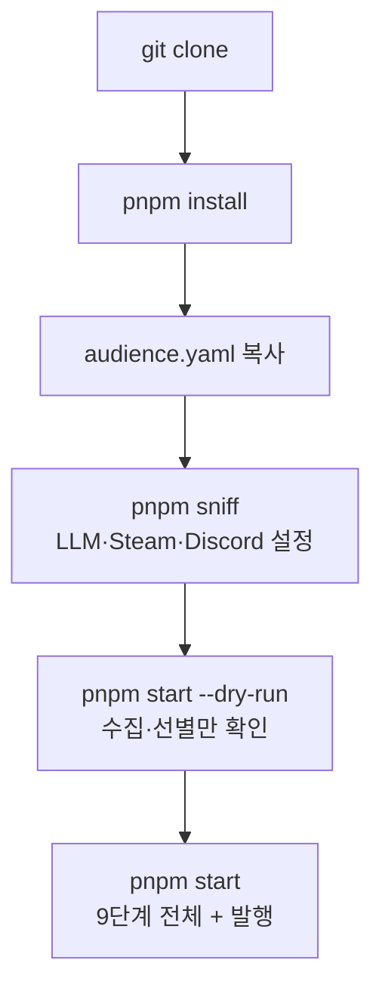

# questail-postie

게임 라이브러리 기반 개인화 뉴스레터 에이전트.
Steam 위시리스트·최근 플레이 게임의 소식을 수집·선별·요약·검수한다.
매일 Discord로 발행한다. TypeScript + LangGraph.js + pnpm.

## 사전 요구사항

| 항목 | 내용 |
| --- | --- |
| Node.js | engines 미지정. `@types/node` 22 기준. 실측 `v24.18.0`. LTS 최신 권장 |
| pnpm | 있으면 사용 (실측 `10.28.2`). 없어도 npm으로 된다 (아래 대응표) |

## 설치부터 첫 실행까지

```sh
git clone https://github.com/chictimin/questail-postie.git && cd questail-postie
pnpm install
cp audience.sample.yaml audience.yaml
pnpm sniff
pnpm start --dry-run
pnpm start
```



- `audience.yaml`은 개인 파일이다. 없으면 sample로 폴백한다.
  appId는 적지 않는다. SteamID로 런타임에 확정한다.
- `sniff`는 `.env`와 전역 설정에 저장한다. 질문 순서는 아래 절 참조.
- `--dry-run`은 파일 기록·발행이 없다. 구경용으로 쓴다.
- `start`는 `output/latest.md`를 덮어쓰고 웹훅이 있으면 실제 발행한다.

### npm으로 돌리기

node+npm만 있어도 된다. 실측: npm `11.16.0`에서 install·typecheck·check:select 성공.

- `packageManager` 필드가 없다. corepack 강제가 없다.
- `.npmrc`·`pnpm-workspace.yaml`이 없다.
- 스크립트가 전부 `tsx` 호출이라 매니저와 무관하다.
- `pnpm-lock.yaml`은 npm이 무시한다. 의존성이 5개라 편차 위험이 낮다.

본문은 pnpm 기준. 대응은 이 표 하나로 본다.
`start`만 `npm start`고 나머지는 `npm run`이 붙는다.

| pnpm | npm |
| --- | --- |
| `pnpm install` | `npm install` |
| `pnpm start` | `npm start` |
| `pnpm start --dry-run` | `npm start -- --dry-run` |
| `pnpm sniff` | `npm run sniff` |
| `pnpm typecheck` | `npm run typecheck` |
| `pnpm check:select` | `npm run check:select` |
| `pnpm check:tiers` | `npm run check:tiers` |

`npm install` 중 "esbuild install scripts not yet covered by allowScripts" 경고가 뜬다.
무시해도 된다. npm 11 정책 문구다.
esbuild는 바이너리를 optionalDependencies로 받아 postinstall 없이 동작한다.

## Steam 연동 준비

계정이 없어도 된다. 건너뛰면 데모 4종으로 돈다.

데모 목록은 `audience.sample.yaml`의 `demo_appids`다.
Palworld·Apex는 라이브러리, Stardew Valley·Elden Ring은 위시리스트로 배분된다.
뉴스 수집은 공개 API라 키 없이도 개인화 점수·섹션이 정상 동작한다.
키가 필요한 건 "이 사람의 목록이 뭔지" 알아내는 부분뿐이다.
키를 등록하면 데모는 무시되고 실제 목록으로 대체된다.
로그에 "데모 목록 4종 (Steam 키 미등록)"이 찍힌다. metrics는 `tiers=demo`다.

Steam 프로필이 있으면 아래대로 등록한다.

1. API 키 발급 — `https://steamcommunity.com/dev/apikey`. 도메인은 아무거나. 무료다.
2. SteamID 입력 — 세 형태를 다 받는다 (`src/steamid.ts`).
   17자리 숫자 / `profiles/숫자` URL / `id/이름` URL 또는 vanity 이름.
3. 입력 즉시 보유 게임 목록을 조회한다. "보유 N건 확인"으로 보여준다.
   0건이면 프로필 **비공개**가 1순위다.
   비공개면 `games`가 비어 와서 빈 목록으로 처리된다. 에러가 아니다.
   프로필 설정에서 "내 프로필"과 "게임 세부 정보"를 공개로 바꾼다.
   위시리스트 비공개도 같은 함정이다.
   조회 실패 시 빈 배열로 조용히 넘어간다.
   Tier0(위시 전수×5건)가 통째로 0건이 된다.
   개인화 섹션이 비는 주된 원인이다.
4. 위시리스트는 `IWishlistService/GetWishlist/v1`로 전수 조회한다 (실측 51건).
   옛 이름 `IStoreService`로 찾으면 안 된다.
5. 최근 플레이는 30일 이내 상위 15종만 쓴다.
   없으면 보유 상위 15종으로 폴백한다. 메타 조회 폭증 방지다.
6. 키(`STEAM_API_KEY`·`STEAM_ID`)는 전역 `~/.config/questail/.env`에만 저장된다.
   저장소·`.env`에는 안 들어간다. `XDG_CONFIG_HOME`이 있으면 그 아래다.
   수집 자체(공개 API·RSS)에는 키가 필요 없다.

## LLM 설정 두 갈래

`.env` 키 이름과 값 예시다.

```sh
# 로컬 (Ollama)
OPENAI_BASE_URL=http://localhost:11434/v1
OPENAI_API_KEY=
MODEL=qwen3:8b

# OpenAI 유료 API
OPENAI_BASE_URL=https://api.openai.com/v1
OPENAI_API_KEY=<키>
MODEL=gpt-4o-mini
```

- 로컬: Ollama 설치 후 `ollama pull qwen3:8b`. 키는 빈 값으로 둔다.
  키가 없어도 로컬 엔드포인트면 호출한다 (`src/llmLocal.ts`).
  **로컬은 느리다.** 항목당 60~75초가 걸린다 (REPORT 근거, 로컬 qwen3:8b 실측).
  8건이면 요약·번역 합쳐 십수 분을 잡아야 한다.
- OpenAI: 위 값 + 키. 8건 기준 수십 초 (지시 수치. 직접 실측 아님).
- 키 없이 원격이면 **절취 폴백**으로 돈다.
  원문 앞문장을 요약 칸에 넣는다. 번역 없이 원어로 발행한다.
  발행물에 `(원문 요약)` 표기가 붙는다. 파이프라인은 멈추지 않는다.

## Discord 웹훅 만드는 법

채널 편집(톱니) → 연동 → 웹훅 → "새 웹훅" → URL 복사.
`DISCORD_WEBHOOK_URL`에 넣는다. 없으면 파일 저장만 한다.

## `pnpm sniff` 질문 순서

방향키(↑↓)+Enter 또는 숫자키로 고른다. 키 입력은 마스킹(`*`)된다.

| 키 | 뜻 |
| --- | --- |
| Enter | 일반 질문: 기본값 유지. 키 입력: 건너뛰기 |
| Esc | 전체 취소. 저장 안 함 |

1. **LLM 프로바이더** — `OpenAI` / `로컬 호환` / `건너뛰기 (폴백 모드)`.
2. **OpenAI** — `API 키`, `모델명` (기본값 `gpt-4o-mini`).
   **로컬** — `베이스 URL` (기본값 `http://localhost:11434/v1`),
   `API 키 (없으면 Enter)`, `모델명` (기본값 `llama3.1`).
   **건너뛰기** — 확인 화면에서 URL·모델이 `(미사용)`으로 뜬다.
3. **Steam 등록** — 상태 표시 후 `SteamID` 입력.
   Enter로 건너뛰면 데모 4종으로 돈다.
   보유 게임 조회가 성공해야 전역 저장한다.
   실패하면 "Steam 등록 실패: ..." 한 줄 + 미등록으로 계속된다.
4. **발행 설정** — `Discord 웹훅 URL`.
5. **확인** — 마스킹 요약 후 `저장 후 실행` / `저장만` / `취소`.
   **`저장 후 실행`은 그 자리에서 정식 실행이 돌고 실제 발행된다.**
   구경만 할 거면 `저장만` 후 `--dry-run`.

## `.env` 직접 편집

sniff 없이 설정할 수 있다.

```sh
cp .env.example .env
```

"LLM 설정 두 갈래" 값 + `DISCORD_WEBHOOK_URL`을 채운다.
Steam 키는 여기 적지 않는다. 전역 파일 전용이다.

## 실행과 결과 확인

`pnpm start --dry-run` — 4줄 로그 후 섹션별 선정 목록을 찍는다.

- `[1/4] 수집 → [2/4] 개인화 → [3/4] 예선 → [4/4] 본선`
- `-- 내 게임 소식` / `-- 그 외 오늘의 소식` / `-- 할인 중인 위시리스트`
- 형식: `- score=.. [라벨] 제목`
- 파일 기록·요약·번역·발행 없음.

`pnpm start` — 9단계 로그가 흐른다.
실물 기준 (`docs/run-terminal.jpeg`, gpt-4o-mini 런):

```text
questail-postie 시작 (gpt-4o-mini) — LLM 요약 모드 · Discord 발행
[1/9] 수집 — Steam 265건(신규 256·할인 9) · RSS 30건 (총 295)
[2/9] 개인화 프로필 — 라이브러리 5종 · 위시리스트 51종
[3/9] 예선 — 295건 → 개인화 30건 · 일반 28건 · 할인 5건
[4/9] 본선 — 개인화 5건 · 그 외 3건 선정
[5/9] 요약 (1/8) Ratatan Digital Pre-orders Are Now Open!
...
[5/9] 요약 완료 — 8건
[6/9] 검수 — 8건 중 8건 통과, 0건 재생성, 0건 탈락
[7/9] 브리핑 생성 — 평문 553자
[8/9] 번역 완료 — 성공 8건 · 실패 0건 · 건너뜀 0건
[9/9] 발행 — 개인화 5 · 그 외 3 · 할인 5 — output/latest.md 저장 ·
  Discord 2개 메시지 전송 성공 · seen 발행 기록 8건
선정 8건, 검수 실패 0건
```

| 결과물 | 내용 |
| --- | --- |
| `output/latest.md` | 최신 발행물. 매 실행 덮어쓴다 |
| `store/metrics.jsonl` | 단계별 실행·검수 기록. 1줄 1레코드 |
| `store/seen.json` | 발행한 항목 id 기록. 아래 참조 |

## 재실행 시 동작

- `seen.json`은 **발행한 항목 id**만 기록한다. 같은 소식이 다시 안 나온다.
- 수집분 전체가 아니다. 떨어진 소식은 다음 후보로 남는다.
- 30일 지난 기록은 저장 시점에 정리된다 (`SEEN_RETENTION_DAYS`).
- 처음부터 다시 보려면 파일을 지운다. 없으면 빈 상태로 시작한다.

## 자동 실행 등록

OS 스케줄러에 건다. 코드 내장 아니다.
`REPORT.md` "매일 아침 실행" 절에 그대로 쓰는 예시가 있다.
macOS `launchd` 권장 (매일 07:00). 크론 대안도 있다.
경로에 사용자명이 박혀 있으니 자기 환경에 맞게 고친다.

## 점검 명령

```sh
pnpm typecheck      # tsc --noEmit
pnpm check:select    # 선별 픽스처 (예선 탈락·본선 점수·라벨)
pnpm check:tiers     # 티어·seen·할인 픽스처 + 실환경 티어 확정
```

## 자주 막히는 지점

- **Steam 키 없음** — 데모 4종으로 돈다. 자기 라이브러리가 아니다.
  `tiers=demo`로 확인한다.
- **보유 게임 0건** — 프로필 비공개가 1순위. 공개로 전환한다.
  그래도 0건이면 API 키·SteamID 확인.
- **로컬 LLM 연결 실패** — `ollama list`로 실행 확인.
  베이스 URL에 `/v1` 포함 확인. `ollama pull` 여부 확인.
  실패하면 폴백으로 계속된다. 멈춘 게 아니다.
- **Discord에 안 옴** — `DISCORD_WEBHOOK_URL` 확인. 없으면 파일 저장만 한다.
  2000자 초과분은 항목 경계에서 분할된다.
- **수집이 0건처럼 보임** — `seen.json`이 발행분을 걸러서다. 정상 동작이다.
  처음부터 보려면 파일 삭제.
- **output이 그대로** — `--dry-run`은 파일을 안 쓴다. 정식 실행인지 확인.

## 구조 한눈에

| 파일 | 한 줄 |
| --- | --- |
| `src/graph.ts` | LangGraph 파이프라인 배선 (아래 흐름) |
| `src/run.ts` | 실행 스크립트 (`--dry-run`·`--help`) |
| `src/collect/tiers.ts` | 티어 수집 (위시 전수·최근 15종·seen·할인 감시) |
| `src/collect/steam.ts` | Steam AppNews·Store 메타 조회 |
| `src/collect/rss.ts` | RSS 수집 |
| `src/steamid.ts` | SteamID → 보유 게임·최근 플레이 확정 |
| `src/personalize.ts` | 게임명 인덱스 구축 (한글명 포함) |
| `src/select.ts` | 예선·본선 2단계 선별 |
| `src/summarize.ts` | 원어 요약 (불릿 2~3개) |
| `src/verify.ts` | 검수·환각 대조 (실패 시 1회 재생성) |
| `src/digest.ts` | 브리핑 (원어, 평문) |
| `src/translate.ts` | 발행 직전 번역 (실패분은 원어 발행) |
| `src/publish.ts` | md 저장 + Discord 발행 (개인화·그 외·할인) |
| `src/llmLocal.ts` | 로컬/원격 판정·전처리·폴백 로그 |
| `src/sniff.ts` | 대화형 설정 (LLM·Steam·웹훅) |
| `src/types.ts` | 공유 타입 계약 |
| `src/globalConfig.ts` | 전역 설정 읽기·쓰기 |
| `scripts/check-select.ts` | 선별 로직 검증 |
| `scripts/check-tiers.ts` | 티어·seen·할인 검증 |
| `store/metrics.jsonl` | 실행·검수 기록 (커밋 대상) |
| `output/latest.md` | 최신 발행물 (커밋 대상, 매 실행 덮어씀) |
| `REPORT.md` | 설계 근거·실행 기록 보고서 |

## 파이프라인 흐름

```text
collect → personalize → filter → rank → summarize → verify → briefing → translate → publish
```

원어 요약·검수 후 발행 직전에 번역한다.
설계 근거는 `REPORT.md`를 본다.

## 주의

- `pnpm start`는 `output/latest.md`를 **덮어쓴다.**
- `DISCORD_WEBHOOK_URL`이 있으면 **실제 발행**한다.
- 확인만 할 거면 `--dry-run`.
