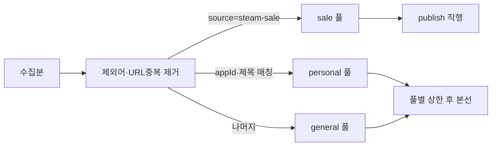
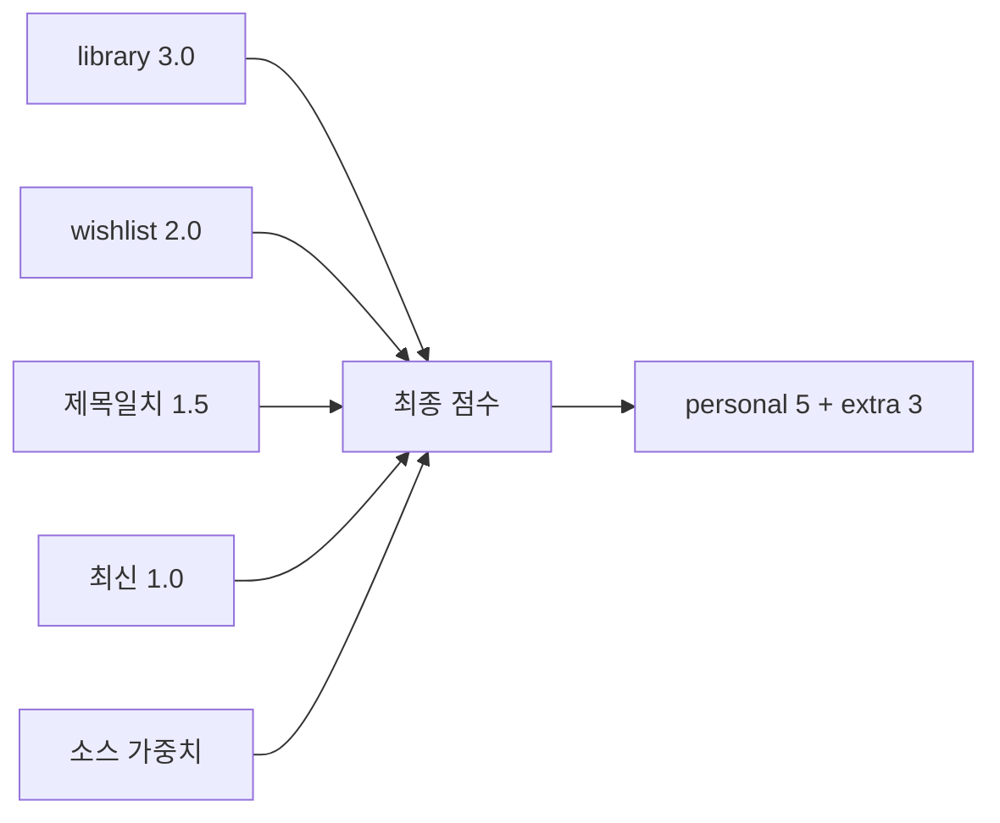
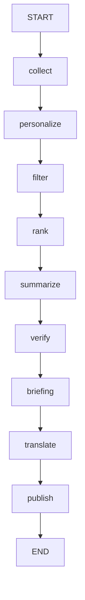
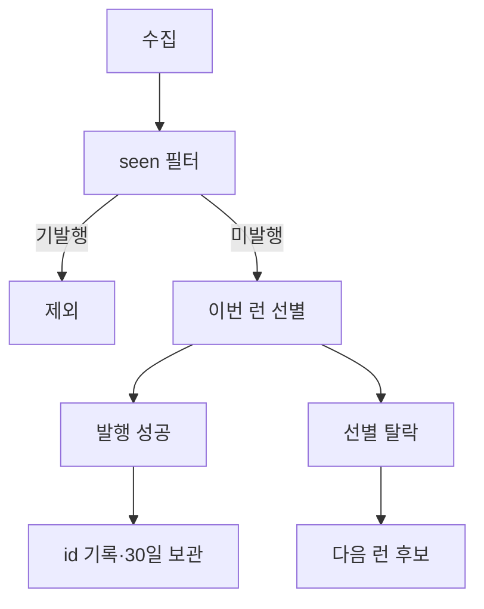
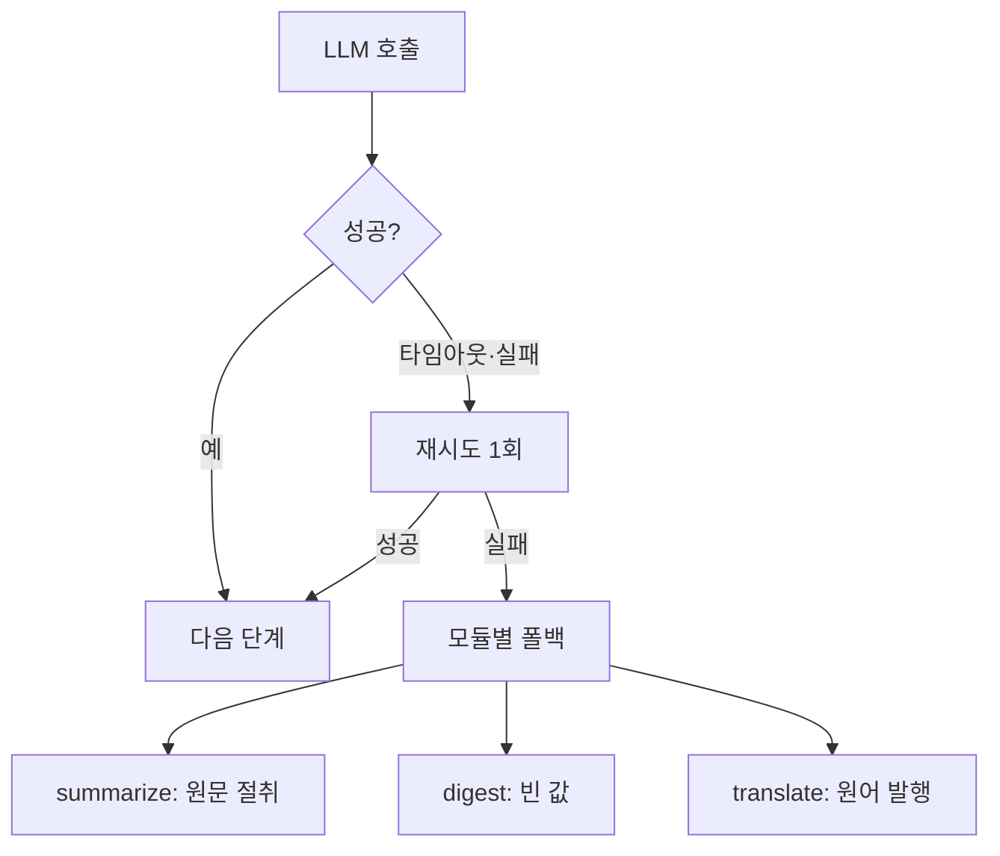

# questail-postie REPORT

게임 라이브러리 기반 개인화 뉴스레터 에이전트.
TypeScript + LangGraph.js + pnpm.
수치·URL은 작업 지시와 저장소 실측만 쓴다. 추정 없음.
실측 출처는 `store/metrics.jsonl`, `check:select`·`check:tiers` 실행 결과,
`src/graph.ts`, `src/collect/tiers.ts`, `store/seen.json`,
`audience.yaml`, `output/latest.md`다.

제출물 구조 (명세 34행 "아래 디렉토리 구조는 예시입니다" — Python 예시에 대한 실제 대응물):

| 명세 예시 | 실물 | 설명 |
| --- | --- | --- |
| `graph.py` | `src/graph.ts` | LangGraph 워크플로우 메인 로직 |
| `run.py` | `src/run.ts` | 실행 스크립트 (`--dry-run`/`--help`) |
| `audience.yaml` | `audience.sample.yaml`(커밋용) + `audience.yaml`(개인, 추적 제외) | 타깃·가중치·제외조건·묶음 크기. appId는 적지 않고 SteamID로 런타임 확정 |
| `requirements.txt` | `package.json` (+ `pnpm-lock.yaml`) | 의존성 목록 |
| `store/metrics.jsonl` | 동일 경로 | 실행·검수 기록. 클론해도 받도록 샘플 1회분을 커밋한다 (추적 대상) |
| `REPORT.md` | 동일 | 본 보고서 |
| (명세 외) `output/latest.md` | 동일 경로 | 발행 산출물. 같은 취지로 커밋 대상이다 |

## 1. 분야 및 독자 정의

- 분야: 게임 뉴스 개인화 뉴스레터.
  수집→선별→원어 요약→검수→번역→발행 일일 파이프라인.
- 독자: 헤비 게이머, 엄호형.
  본인 Steam 라이브러리·위시리스트 소식을 놓치지 않으려는 사람.
- 관심사: 신작·패치·할인 + 인디.
  (`audience.sample.yaml`: platforms PC, genres RPG·인디)
- 제외: e스포츠. 제목 포함 시 예선 탈락.
  (`audience.sample.yaml` exclude)
- 개인화 단위: 수기 appId 없음. SteamID 하나로 런타임에 확정한다.
- 실측: 보유 120건 · 위시 51건 · 최근 30일 플레이 5건.
  (근거: `check:tiers` live, Steam API 직접 조회 `owned=120`)
- 보유 수는 무료 플레이 게임 포함 기준. 제외 시 116건.
  (`src/steamid.ts:96` `include_played_free_games=true`)
- 라이브러리 = 최근 플레이 상위 15종. 없으면 보유 상위 15종으로 폴백한다.
  (상수 `TIER1_MAX_APPS=15`. 120종 전체 조회 폭증 방지)
- 실측 `library=5`는 최근 플레이가 5종뿐이라서다. 위시는 전수다.
- 데모 폴백 (키 미등록 리뷰어용):
  - 배경: 키가 없으면 빈 티어라 RSS 30건만 수집됐다.
  - 개인화 섹션이 비어 핵심 기능을 볼 수 없었다.
  - `demo_appids` 4종으로 개인화가 돈다.
  - 앞절반=라이브러리(Tier1×3), 뒷절반=위시리스트(Tier0×5).
  - 가산 3.0과 2.0이 둘 다 보이게 절반씩 나눴다.
  - 위시는 할인 감시 대상에 자동 포함된다.
  - 선정 근거 (ISteamNews 직접 조회, 2026-09-15 실측):
  - Palworld 0일·Apex 1일·Stardew 6일·Elden Ring 8일. 전부 8일 이내다.
  - Hades(1145360)는 91일 전이라 탈락시켰다.
  - 장르는 서바이벌·FPS·인디·RPG로 섞었다.
  - 왜 키 없이 되는가: AppNews는 공개 API라 쿼리에 key가 없다.
  - 키가 필요한 건 위시·보유 조회뿐이다. appId만 있으면 된다.
  - 모드 표시: `steamSource`에 "demo" 값이 있다.
  - metrics에 `tiers=demo`로 기록된다. 실행 기록만 봐도 모드가 드러난다.
  - 조용히 돌지 않는다. 진행 로그에 "데모 목록 4종 (Steam 키 미등록)"이 찍힌다.
  - sniff에도 안내·건너뜀 확인·확인 화면이 있다. 오해 방지용 설계다.
  - 키가 있으면 데모는 무시된다. 데모도 비면 빈 티어로 간다.

## 2. 소스 채택표

### 채택 (검증 수치)

| 소스 | 검증 결과 | 비고 |
| --- | --- | --- |
| Steam AppNews Tier0 — 위시 전수 (`https://api.steampowered.com/ISteamNews/GetNewsForApp/v2/`) | 위시 51종 × 앱당 5건, 키 불필요 | `TIER0_NEWS_COUNT=5` (`src/collect/tiers.ts`) |
| Steam AppNews Tier1 — 최근 30일 플레이 (`https://api.steampowered.com/ISteamNews/GetNewsForApp/v2/`) | 최근 5종 × 앱당 3건, 키 불필요 | `TIER1_NEWS_COUNT=3`, `TIER1_RECENT_DAYS=30` |
| Steam 할인 감시 (Store `appdetails` `price_overview`) | 정식 런 실측 sale=9 (06:15) | 20%+ 합성. `batch.sale` 5 상한, 별도 섹션 발행. 항목은 한 줄 (불릿 없음) |
| r/Games RSS (`https://www.reddit.com/r/Games/new/.rss`) | 25건 | reddit_feeds |
| PC Gamer RSS (`https://www.pcgamer.com/rss/`) | 50건 | press_feeds |
| VG247 (`https://www.vg247.com/feed`) | 100건 | press_feeds |
| PCGamesN (`https://www.pcgamesn.com/mainrss.xml`) | 75건 | press_feeds |
| GamesIndustry.biz (`https://www.gamesindustry.biz/feed`) | 100건 | press_feeds |
| RPG Site (`https://www.rpgsite.net/feed/`) | 25건 | press_feeds |
| 데모 목록 4종 (키 없는 리뷰어용) | Palworld·Apex·Stardew·Elden Ring | 앞절반 라이브러리 + 뒷절반 위시. 키 있으면 무시 |
| Rock Paper Shotgun RSS | 100건 | 검증됨, 파이프라인 미사용 |
| Eurogamer RSS | 100건 | 검증됨, 파이프라인 미사용 |
| Gematsu RSS | 20건 | 검증됨, 파이프라인 미사용 |
| Kotaku RSS | 20건 | 검증됨, 파이프라인 미사용 |

아래 수치는 2026-09-15 12:22 커밋(`7dc3d2e`) 이전에 잰 스냅샷이다.
RSS 검증은 `rss-parser`로 파싱한다. 성공 기준은 items 1건 이상.
방문자수 근거(참고):
Polygon 36.11M · GamesRadar+ 16.79M · RPG Site 6.87M · Nintendo Life 약6M ·
Destructoid 5.36M · GamesIndustry.biz 5.23M · PCGamesN 5.17M ·
VG247 약2.3M · Siliconera 1.52M · Shacknews 1.19M.
(Semrush 2026-06/07, SimilarWeb 병기)

### 탈락

| 소스 | 사유 |
| --- | --- |
| IGN feed URL | 404 |
| r/indiegames·r/GameDeals RSS (429 시) | 탈락이 아니라 0건 허용. 해당 피드만 건너뛰고 계속 수집한다. Reddit 3종은 항상 시도한다 |

### 실제 파이프라인 사용 (런타임 확정 기준)

- 수집 구성 (자세한 동작은 §3·§4):
  - Tier0: 위시 전수 × 앱당 5건.
  - Tier1: 최근 30일 플레이 × 앱당 3건.
  - 할인 감시: 20%+ → `steam-sale` 합성.
  - seen 증분: 발행분 id만 기록. Steam 수집분 대상 (RSS·할인 제외).
  - RSS 그대로: Reddit 3종 + 언론 5종.
  - Reddit 429 시 해당 피드 0건으로 수집 계속.
    (근거: `src/collect/rss.ts:71`)
- 위시리스트는 `IWishlistService/GetWishlist/v1/`로 전수 조회한다.
  예전 이름(`IStoreService/GetWishlist/v1/`)은 404가 난다.
  올바른 이름은 정상 동작한다. 실측 51건. appId 수기 관리는 없어졌다.
  전부 SteamID 런타임 확정이다.
- RPS·Eurogamer·Gematsu·Kotaku는 검증됐으나 미사용이다.
  (`audience.sample.yaml` 미포함)

## 3. 선별 로직 설계

흐름: personalize → filter → rank (`src/graph.ts` 노드 순서).

- personalize (`src/personalize.ts` `buildProfile`): 게임명 인덱스를 만든다.
  입력은 티어 확정값이다 (라이브러리·위시리스트 appId, 가중치 포함).
  06:15 런 기준 `library=5 wishlist=51`, titleIndex 55건.
- 한글명 색인: Store 한글명에서 한글 구간(4자 이상)을 뽑아 영문명과 함께 등록한다.
  (`[가-힣][가-힣\s]*[가-힣]` 패턴)
  한글 제목 기사도 제목 일치 가산 대상이다.
- 예선 filter (`src/select.ts` `filterNews`): 세 풀을 반환한다.
  (`{sale, personal, general}`, `src/select.ts:58-62`)



  - `sale`을 먼저 떼어낸다. 개인화 풀에 들어가지 않게 하기 위해서다.
  - 상한은 따로 건다. sale 5건, personal·general 각 30건.
  - 빈 풀은 다른 풀이 메우지 않는다.
- 본선 rank (`src/select.ts` `rankFinal`): 풀별로 실행한다.



  - appId 일치하면 전부 가산한다.
  - 제목 일치하면 절반 가산한다 (`titleMatch` 1.5, 하드코딩).
  - 72시간 이내 발행이면 최신 가산한다 (+1.0).
  - 소스 가중치를 합산한다. url·source 부분일치다 (최장 키 우선).
  - 값: default 1.0 / r/Games 1.2 / indiegames 0.3 / GameDeals 0.5 /
    pcgamer 2.0 / vg247·gamesindustry 1.8 / pcgamesn 1.6 / rpgsite 1.4.
  - 등급 라벨: 1.4 이상 press, 0.8 이상 community, 그 외 `source:low`.
  - 가중치 키: `weights.library_match`·`wishlist_match`·`recency_hours`.
  - 라벨은 항상 붙는다. `unranked` 폴백은 실행되지 않는다.
  - 뽑는 수: personal 5건, extra 3건. 점수 내림차순이다 (동점 시 최신순).
  - 넣은 이유: 자가 홍보 글("팝릿" 사례)이 언론 기사를 밀어냈다.
  - 실증: 정식 런 extra 3건 전부 `source:press`.
  - 정직한 고지: 값과 경계(1.4·0.8)는 순서용 초기 휴리스틱이다.
    "언론 > 커뮤니티 > 딜·자가홍보". 운영하며 조정한다.
- 묶음 크기 이유 (명세 요구):
  - 수집량이 수백 건대다 (정식 런 271~280건). 읽고 고를 단위로 줄인다.
  - 예선 풀별 30건. 어느 한쪽이 다른 쪽을 밀어내지 못하게 한다.
  - 본선 개인화 5건 + 그 외 3건. 독자 게임 소식이 주인공이다.
  - 명세 "핵심 뉴스 3~5건" = 개인화 5건.
  - 그 외 3건·할인 5건은 부가 섹션이다.
  - 할인은 본선·요약·검수·번역을 타지 않는다.
  - 그래서 핵심 뉴스 계산에 안 들어간다.

`pnpm check:select` 실행 결과 (2026-09-15 작업트리 — 종료 코드 0):

```text
profile titleIndex=3 library=440
filter: in=10 personal=3 general=4 sale=1
personal ids: steam-440-g1,rss-aaaa,rss-ko
general ids: rss-press,rss-promo,rss-fresh,rss-old
sale ids: sale-1940340
rank final=2
- steam-440-g1 score=5 labels=library+recent+source:community title=MGE.tf is back!
- rss-aaaa score=3.5 labels=wishlist-title+recent+source:community title=Stardew Valley 1.6 패치 정리
rank extra=1
- rss-press score=3 labels=recent+source:press title=Same-hour press review roundup
general order: rss-press,rss-fresh,rss-old,rss-promo
ko title match: rss-ko score=3.5 labels=wishlist-title+recent+source:community
OK check:select
```

풀 분할은 의도대로 동작한다.
10건 → personal 3·general 4·sale 1 (sale 분리 포함).
본선도 의도대로다. personal 2건이 1·2위, extra 1건이다.
`general order`에서 press 가산 항목이 선두다.
소스 가중치가 순서에 반영된 근거다.
`ko title match` 행은 한글 제목 매칭의 근거다.

키 없는 dry-run 실측 (데모 모드):
Steam 16건 수집(위시 2종×5 + 최근 2종×3).
예선 개인화 16·일반 30, 본선 5+3.
`score=5 library+recent` 항목 확인.
(dry-run은 metrics를 남기지 않는다. §5 기록 없음)

## 4. 파이프라인 구조도

`src/graph.ts` 기준 (`@langchain/langgraph` StateGraph, START→…→END 일직선):



상태(State) 흐름 (`src/graph.ts:44-85` `PipelineState`. 노드는 START→END 일직선으로 돌고 아래 칸을 주고받는다):

| 상태 | 쓰는 노드 | 읽는 노드 |
| --- | --- | --- |
| `rawItems` | collect (수집분 전부) | filter (예선 재료) |
| `profile` | personalize (게임명 인덱스) | filter (개인화 판정), rank (점수 가산) |
| `filtered` | filter (personal+general 합침) | rank (풀 재분할 후 본선), briefing (브리핑 재료) |
| `sale` | filter (할인 분리분) | publish (할인 섹션) |
| `finalSel` | rank (개인화 5 + 그 외 3) | summarize (요약 대상) |
| `summaries` | summarize (원어 작성) → verify (통과분으로 교체) → translate (한국어 채움) | publish (발행) |
| `verdicts` | verify (통과·실패·재생성 기록) | `run.ts` (metrics `verdict-fail` 기록용) |
| `digest` (원어 평문) | briefing | translate (번역 재료), publish (발행) |
| `digestKo` (번역문) | translate | publish (발행) |
| `delivered` | publish (전송 성공 여부) | (최종 반환값) |

- 왜 LangGraph(StateGraph)인가.
  체인은 일직선이다. 그래도 상태 계약과 순서 관리를 엔진에 맡긴다.
- `recursion_limit` 미설정. 순환이 없어 불필요하다.
- 이름 별칭: 노드명 `briefing` = 단계명·상태명 `digest`. 같은 단계다.

- collect: 티어 확정 후 병렬 수집한다.
  Tier0(위시 전수×5) + Tier1(최근30일×3) + RSS(reddit+press).
  게임명·장르를 캐시한다. 할인은 20%+만 합성한다.
  seen은 걸러내기만 하고 저장은 publish 뒤로 미룬다.
  (로그 형식: `steam=X(fresh=Y sale=Z) rss=W tier0=A tier1=B`)
- seen (증분 구조): 발행한 항목 id만 기록한다.
  (`{published: {itemId: unixSec}}`)



  - 바뀐 이유: 구 커서는 수집 전체를 "봤다"로 기록했다.
    발행 5건인데 241건이 그렇게 됐다. Steam 공지가 못 올라왔다.
  - 기록 시점은 publish 성공 후다. 하류 실패 시 저장을 건너뛴다.
  - Discord 실패해도 파일 저장됐으면 기록한다.
  - 30일 초과 기록은 정리한다 (`SEEN_RETENTION_DAYS`, seen 유효기간).
  - 할인은 기록하지 않는다. 가격 바뀌면 다시 알려야 한다.
  - 한계: 구 형식은 빈 published로 시작한다. 첫 1회는 중복 가능.
  - 근거: `src/collect/tiers.ts:80-135`, `src/graph.ts:114-115,267-271`.
  - 실측: 06:22 런 Steam 265건 중 8건 기록, 257건 후보 유지.
- personalize: 게임명 인덱스를 만든다.
  06:15 런 기준 library 5·wishlist 51.
- filter: 세 풀 분리한다 (§3). sale 5건, personal·general 각 30건.
- rank: 풀별로 뽑는다. personal 5건, extra 3건 (§3).
- summarize: 원어 2~3줄 요약. 번역은 안 한다 (translate 담당).
  모자라면 제목으로 메운다.
  항목별 인사이트는 두지 않는다. 명세 3단계 답변은 이렇다 —
  항목 요약은 사실 전달에 집중한다. 인사이트는 선두 브리핑이 전담한다.
  항목 한 줄은 뻔해지기 쉽다.
  전체를 훑고 짚는 편이 쓸모 있다는 판단이다.
  (사용자 결정)
  키 없이도 돈다 (로컬호스트 baseURL). 실패 시 원문 절취 폴백.
  게임명·플랫폼·출처를 기록한다 (폴백·LLM 공통).
  출처: Steam "Steam 공지", 할인 "Steam 할인", RSS 피드 title.
  - 근거: `summarize.ts:89-92,115-128`, `llmLocal.ts` `canCallLlm`.
  - 키·모델은 `.env`에서 읽는다 (`OPENAI_BASE_URL`·`OPENAI_API_KEY`·`MODEL`).
- verify: 4종 검사한다.
  제목 토큰 포함 / url·원문 매핑 / 원어 300자 초과 탈락 / 연도·날짜 대조.
  한국어 200자는 탈락이 아니라 절단 수용이다.
  실패하면 재생성 1회 (`resummarize`). 그래도 실패하면 스킵한다.
  원어 상태에서 검사한다. 번역 뒤에 하면 영어 토큰을 못 찾기 때문이다.
  그래서 translate는 verify 뒤에 둔다.
  - 근거: 상수 `MAX_LINE_CHARS_SRC`(원어)·`MAX_LINE_CHARS_KO`(한국어),
    대조 범위 `src/verify.ts:75-78`.
  관측 기록 (06:15 런): 연도·날짜 검사 발동 → 재생성 1회 → 탈락 → 스킵.
  대조 범위는 제목+본문이다. 원문 미확보라 단정하지 않는다.
  같은 런 verify count=7 (8건 중 7건 통과·1건 스킵):

  ```text
  {"ts":"2026-09-15T06:15:22.450Z","stage":"verdict-fail","count":0,"detail":"rss-7f18b06fb0a5baed:재생성 후에도 실패: 원문에 없는 연도·날짜 표현: 2027 (기존 실패: 원문에 없는 연도·날짜 표현: 2027)"}
  ```
- briefing: 선별 풀 제목 목록으로 평문 1문단(2~3문장)을 만든다.
  md·Discord 모두 헤더 없이 들어간다. 없거나 실패하면 생략된다.
  이 브리핑이 인사이트 역할을 맡는다.
  프롬프트가 독자 관점을 직접 지시한다 (heavy gamer 정의, 핵심 1~2건 집중).
  - 근거: `src/digest.ts:47-55`.
- translate: 발행 직전에 한국어로 번역한다. 성공하면 `translated: true`.
  불릿 2~3개 허용. 원문 개수 일치를 본다. 200자 초과는 절단 수용.
  실패하면 1회 재시도한다. 그래도 실패하면 원어 발행한다.
  항목 단위 호출이라 한 건 실패해도 나머지는 번역된다.
  한국어 원문은 호출 없이 통과시킨다.
  - 근거: `src/translate.ts:69-82` (검증), `:138-141` (재시도).
- publish: 항상 `output/latest.md` 저장. 웹훅 있으면 전송한다.
  세 섹션 순서: 개인화 → 그 외 → 할인. 빈 섹션은 문구로 표시한다.
  항목 형식: 제목 + 불릿 2~3개 + 출처 행. 게임명 행은 켜져 있다.
  `gameName` 있는 항목에만 붙는다. RSS분은 생략된다.
  md: `- 출처: {사이트} · [원문](url)`.
  Discord: `[출처: {사이트}](<url>)`. 미리보기 억제 확인됨 (§5 캡처).
  하나로 묶어 보내고, 초과 시 항목 경계에서 분할한다.
  한 항목 초과 시 그 항목만 절단한다.
  - 근거: `publishAll({personal, extra, sale})`.
  - 섹션명: `내 게임 소식` / `그 외 오늘의 소식` / `할인 중인 위시리스트`.
  - 빈 섹션 문구: `(오늘은 해당 소식이 없습니다)`.
  - 게임명 행 조건: `output.show_game_line: true`, `src/publish.ts:37-43`.
- 진행 로그: 9단계가 stdout에 찍힌다.
  `[1/9]` 수집 … `[9/9]` 발행 (노드 순서대로).
- 기록: 각 노드가 `MetricRecord`를 `store/metrics.jsonl`에 append (`src/run.ts`).
  `--dry-run`은 수집·선별까지만 보여주고 기록하지 않는다.

### 폭주 방지 장치 (한 곳에 묶음)

| 장치 | 값 | 위치 |
| --- | --- | --- |
| 수집 fetch 타임아웃 | 15초 | `rss.ts:6`·`steam.ts:26`·`tiers.ts:25`·`steamid.ts:7` |
| LLM 호출 타임아웃 | 180초 | `llmLocal.ts:7` (3모듈 공유: `summarize.ts:168`·`digest.ts:36`·`translate.ts:115`) |
| LLM 재시도 | 1회 (최악 6분/항목) | `llmLocal.ts:8` (상한 주석 `:6`) |
| 검수 재생성 | 1회 | `verify.ts:92` |
| 번역 재시도 | 1회 | `translate.ts:138-141` |
| `recursion_limit` | 미설정 | 순환 없음 (일직선) |



  - 재시도 내역: summarize·digest는 SDK 내부 재시도만 있다.
  - translate만 바깥 루프가 한 겹 더 있다.

- 180초 근거: 로컬 qwen3:8b 실측이 항목당 60~75초다.
  thinking 모델 편차를 감안해 약 2.4배로 잡았다.
  무한 대기는 막되 정상 호출은 끊지 않는다.
  SDK 생성자 옵션(`timeout`, `maxRetries`)으로 적용한다.
- 재시도 1회 근거: 기본값 2는 최악 대기가 3배가 된다.
  느린 모델은 재시도해도 또 끊길 가능성이 높다.
  일시 오류에는 1회로 충분하다.
  최악 대기 = 180초 × 2회 = 6분이다.
- 타임아웃 후 처리는 위 그림과 같다. 새 경로를 만들지 않았다.
- stderr에 타임아웃과 일반 실패를 구분해 남긴다.
  (`[stage] LLM 호출 타임아웃(180000ms)...`, `src/llmLocal.ts:54-55`)

## 5. 실행 기록

`store/metrics.jsonl` 읽는 법 (세대차 안내).
이 파일은 207줄 전체를 그대로 커밋한다.
개발 과정 전체가 시간순으로 쌓인 기록이다 (02:59→06:54).
폴백 런·검수 탈락·증분 동작 근거가 전부 들어 있다.
다만 seen 구조가 바뀌어서, 최신 런만 현행 코드 기준이다.
05:26·06:15·06:23·06:27 런은 전부 구 커서 방식 시절 기록이다.
06:53 정식 런(아래 표)이 현행 구조 첫 기록이다.
그래서 06:27의 `fresh=0` 같은 수치는 구 동작의 결과로 읽어야 한다.
("수집분 전체를 봤다"로 기록하던 시절이다.)
현행 구조에서는 같은 상황이 재현되지 않는다.
미발행 수집분은 다음 런 후보로 남는다.
옛 레코드를 무시하라는 뜻이 아니다. 근거 가치는 그대로다.
세대만 구분해서 읽으면 된다.
`store/seen.json`은 새 형식만 남는다 (구 형식은 삭제되고 새로 생성됨).

`store/metrics.jsonl` 정식 런 실측 (2026-09-15T06:53~06:54.
프로바이더 OpenAI 유료 API, `gpt-4o-mini` — 아래 캡처 첫 줄 확인.
`--dry-run`은 `src/run.ts:127-130`에서 기록 전에 return하므로 metrics를 남기지 않는다):

| stage | count | detail |
| --- | --- | --- |
| collect | 295 | steam=265(fresh=256 sale=9) rss=30 tier0=241 tier1=15 tiers=steam |
| personalize | 55 | library=5 wishlist=51 noMeta=0 |
| filter | 58 | pool=295 personal=30 general=28 sale=5 |
| rank | 8 | personal=5 + extra=3 (라벨 아래 참조) |

personal 라벨: wishlist×2 + library×3 (전부 source:community).
extra 라벨: recent+source:press ×3.
| summarize | 8 | sourceKo=0 |
| verify | 8 | 8 pass (재생성 0건) |
| digest | 1 | chars=553 pool=58 |
| translate | 8 | ok=8 ko=0 failed=0 skipped=0 |
| publish | 8 | delivered=true parts=2 sale=5 seen=8ids |

- fresh=256 — seen 구조 변경의 실증이다.
  구 커서 시절 06:27 런은 fresh=0이었다.
  현행은 미발행분이 후보로 남아 256이 수집됐다.
- seen=8ids — 295건 중 발행 8건만 기록했다.
  (Steam 265건 중 8건 기록·257건 후보 유지. RSS 30건 별도)
- translate ok=8 — 전건 번역 성공이다.
- verify 8/8 pass — 환각 탈락 없었다. 06:15 관측과 구분된다.
- parts=2 — Discord 2개 메시지로 분할됐다. 분할 동작 기록이다.


위 캡처에 9단계 진행 로그와 발행 결과가 모두 보인다.
(`[1/9]` 수집 … `[9/9]` 발행. 선정 8건·검수 실패 0건·발행 파일 경로)
명세 52행 "정상 발행된 결과 화면 캡처" 요구에 이 캡처로 답한다.
터미널 캡처는 파이프라인 실행 증거이다.
아래 Discord 캡처는 목표 채널 전달 증거다. 역할이 다르다.


- 위 캡처에서 직접 확인한 것만 적는다.
- 발신자: Questail 앱(웹훅), 시각 오후 3:54.
- 브리핑 평문이 헤더 없이 먼저 온다 (md와 동일).
- 그 아래 "내 게임 소식" 헤더가 있다.
- 항목 순서: 제목(볼드) + 불릿 + 게임명 행 + 출처 링크.
- 게임명 행 예시: "게임: Ratatan · Windows" (Steam 수집분만).
- 출처는 링크로 뜨고 미리보기가 없다. `<>` 처리의 증거다.
- 불릿은 항목당 2개. 2~3개 허용의 결과다.
- 두 번째 메시지·할인 섹션은 프레임 밖이다.
- 그 부분은 `parts=2`·`sale=5`로 뒷받침한다.
- 명세 5단계 최종 발행 확인에 이 캡처로 답한다.

`pnpm check:tiers` 실측:

```text
tiers constants: Tier0=5 Tier1=3 recent=30d sale>=20%
seen: in=5 fresh=3 ids=steam-440-101,steam-440-102,steam-252490-1
seen published-set OK (발행분만 제외, 미발행분은 다음 런 후보)
[seen] 구 형식 seen.json(apps 커서)을 발견 — published 빈 집합으로 시작합니다
seen migration OK (구 apps 형식 → 빈 published)
sale threshold OK (19→drop, 20/75→steam-sale)
tiers live: source=steam wishlist=51 recent=5 library=5
OK check-tiers
```

- `output/latest.md` (06:54 덮어씀, 정식 런 산출): 한국어 번역 상태.
  브리핑 평문 문단 (헤더 없음).
  내 게임 소식 5건(라타탄·Triple-i·콘텐츠 업데이트·Retail Hell·Trial by Fryer).
  그 외 3건(Aniimo·킹메이커스·디아블로 IV). 할인 5종.
  항목마다 제목 + 불릿 + 출처·원문 링크.
- Discord: 위 정식 런 `delivered=true`(metrics 기록). 수신 화면은 위 캡처 참조.
- 환각 검수 관측 (06:15 런, 위 정식 런과 다른 런).
  연도·날짜 검사가 발동했다 (`2027` 표현). 재생성 1회 후 탈락, 스킵했다.
  verify count=7 (8건 중 7건 통과·1건 스킵). 원문 기록은 §4 참조.
- 주의: `output/latest.md`는 매 실행마다 덮어쓴다.
  위 인용은 열람 시점 기준이다. 후속 런에 덮어씌워질 수 있다.
- 참고: 티어 적용 전 런(03:41)은 collect 45·personalize library=2였다.
  그 이전 런들은 폴백·웹훅 미설정 상태였다. 파일 저장은 항상 수행했다.

### 매일 아침 실행 (스케줄러 — 코드 내장 대신 OS에 거는 방법)

명세 첫 줄 "매일 아침"에 대한 답이다.
스케줄러를 코드에 내장하지 않는다. OS 스케줄러에 건다.
아래는 이 저장소 기준 그대로 동작하는 형태다.
전제: `.env`에 키·웹훅 설정이 있다.
(없으면 폴백 요약 + 파일 저장만 수행하고 멈추지 않는다).

macOS `launchd` (권장): `~/Library/LaunchAgents/com.questail.postie.plist`
`/path/to/questail-postie`는 저장소를 클론한 실제 경로로 바꾼다.

```xml
<?xml version="1.0" encoding="UTF-8"?>
<!DOCTYPE plist PUBLIC "-//Apple//DTD PLIST 1.0//EN" "http://www.apple.com/DTDs/PropertyList-1.0.dtd">
<plist version="1.0">
<dict>
  <key>Label</key>
  <string>com.questail.postie</string>
  <key>ProgramArguments</key>
  <array>
    <string>/bin/zsh</string>
    <string>-lc</string>
    <string>cd /path/to/questail-postie && pnpm start</string>
  </array>
  <key>WorkingDirectory</key>
  <string>/path/to/questail-postie</string>
  <key>StartCalendarInterval</key>
  <dict>
    <key>Hour</key>
    <integer>7</integer>
    <key>Minute</key>
    <integer>0</integer>
  </dict>
  <key>StandardOutPath</key>
  <string>/path/to/questail-postie/store/scheduler.log</string>
  <key>StandardErrorPath</key>
  <string>/path/to/questail-postie/store/scheduler.err.log</string>
</dict>
</plist>
```

등록: `launchctl load ~/Library/LaunchAgents/com.questail.postie.plist`.
`zsh -lc`는 로그인 셸 PATH에서 pnpm을 찾는다.
PATH에 없으면 `pnpm start`를 절대경로로 교체한다.
절대경로는 `which pnpm`으로 확인한다 (예: `~/Library/pnpm/pnpm`).

크론 대안 (매일 07:00):

```sh
0 7 * * * cd /path/to/questail-postie && $(which pnpm) start >> store/scheduler.log 2>&1
```

## 6. 프로젝트 회고

공들인 부분:

- `tsx` + readline 입력 대기 우회: 프롬프트 대기에 걸리지 않게 한다.
  `src/run.ts`는 인자 방식으로만 동작한다. 대화형 입력을 받지 않는다.
- hang 타임아웃: 수집(RSS·Steam API)과 LLM 호출에 타임아웃을 두고,
  키 미설정·호출 실패 시 절취 폴백으로 파이프라인이 멈추지 않게 했다
  (`summarize.ts` 폴백, `publish.ts` 웹훅 실패 시 파일 저장 유지).
  수집계 fetch 타임아웃은 전부 15초로 고정돼 있다
  (`rss.ts:6`·`steam.ts:26`·`tiers.ts:25`·`steamid.ts:7`).
  LLM 호출 타임아웃은 180초·재시도 1회다.
  (`src/llmLocal.ts:7-8`, 아래 폭주 방지 장치 참조)
- 개인화 분리: `personalize.ts(buildProfile)`를 선별과 분리해
  프로필 입력(가중치·인덱스)이 바뀌어도 rank 로직을 바꾸지 않는 구조
  (`filterNews`/`rankFinal`은 프로필·가중치를 인자로만 받음).

개선점 (Could):

- SteamID 런타임 확정됨. 키는 전역 파일에서 읽기만 한다.
  (`STEAM_API_KEY`·`STEAM_ID`, `src/collect/tiers.ts`, `src/globalConfig.ts`)
  보유·위시·최근 플레이를 확정한다. 키가 없으면 RSS만으로 돈다.
  위시 API 오진도 해소됨. `IWishlistService` 정상 동작 (실측 51건).
- 미출시·e스포츠 제외: e스포츠는 제외어 처리됨이다.
  미출시작 루머 등은 정교화가 남는다.
  (예: 출시 상태·중복 주제 클러스터링)
- Discord 피드백 루프 (확장 방향, 구현 안 함 — 사용자 결정: 문서화만).
- 질문: 웹훅 투표/피드백으로 가중치를 조절할 수 있는가. 답: 가능하다.
- 확인 사실 (Discord API 문서 기준):
  - 웹훅은 자기 메시지를 다시 읽는다. 봇 토큰 불필요.
  - `POST /webhooks/{id}/{token}?wait=true`로 id를 받는다.
  - `GET /webhooks/{id}/{token}/messages/{message.id}`로 조회한다.
  - `wait` false면 204만 온다. 현재 코드는 `wait` 없이 보낸다.
- 제약: 일반 웹훅은 클릭 버튼 불가. 앱(봇)이 별도로 필요하다.
  (`with_components` 제한, non-owned 웹훅)
- 미확인: `reactions` 필드가 채워 오는지. 구현 전 실측 필요.
- 스케치: `wait=true`로 id 저장. 다음 실행 때 조회·집계한다.
  신호를 모아 `source_weights`에 반영한다.
  하루 1회 배치라 Gateway 불필요. 웹훅 토큰만으로 닫힌다.
- 한계: 하루 8건·소수 독자·피드 8개라 신호가 극소다.
  학습 성립에 수십 일이 걸린다.
  100건 표본 직접 확인이 하루 만에 끝난다. 그쪽이 빠르다.
  독자가 여럿일 때 착수할 확장이다.

결정 기록 (사용자 판단 — 에이전트 구현과 구분):

- 로컬 LLM으로 돌리려던 의도 (정식 런은 OpenAI 유료 API로 확정)
- 발행물 형식: 인사이트 제거·digest 평문·항목 축소·Discord 단일 메시지
- 할인 별도 섹션
- 라이브러리 15개 한정
- 소스 가중치 도입
- 인사이트를 digest로 옮기기
- 실행 기록 샘플 커밋
- 스케줄러는 문서화로 갈음
- 본 프로젝트(questail) 흡수 검토 — 아래 참조

### questail 본 프로젝트로의 흡수 검토

이 실습은 별도 저장소로 시작했지만, 본 프로젝트
[questail](https://github.com/chictimin/questail)에
기능을 흡수하는 방향을 검토 중이다. 현재 확인된 접점과 조정 지점을 남겨둔다.

**이미 공유하는 것**

전역 설정 파일이 같다. `~/.config/questail/.env`에 `STEAM_API_KEY`·`STEAM_ID`를 두고
양쪽이 읽는다. `src/globalConfig.ts`는 questail `packages/core/src/cli.ts`의 패턴을
그대로 따랐고, `XDG_CONFIG_HOME` 처리도 동일하다. 즉 사용자가 한쪽에서 Steam을 등록하면
다른 쪽도 바로 쓴다.

**중복되는 것**

| 기능 | questail | questail-postie |
| --- | --- | --- |
| Steam 연동 | `packages/core/src/connectors/steam.ts` | `src/steamid.ts`, `src/collect/steam.ts` |
| 대화형 설정 | `cli.ts`의 `sniff` | `src/sniff.ts` |

SteamID 해석(URL·vanity → SteamID64)과 보유 게임 조회는 양쪽에 따로 있다.
흡수한다면 questail 커넥터를 재사용하고 postie 쪽을 걷어내는 게 맞다.
`sniff`라는 이름 자체가 questail에서 가져온 것이라 CLI도 하나로 합쳐야 한다.

**postie 고유 자산**

questail에 없는 것은 뉴스레터 파이프라인 전체다 — RSS 수집, 예선·본선 2단계 선별,
소스 가중치, 원어 요약과 발행 직전 번역, 환각 검수, seen 증분, Discord 발행.
questail이 커넥터 아키텍처(`connectors/`)를 쓰므로, RSS를 커넥터로 편입하고
파이프라인을 별도 패키지(`packages/postie` 등)로 두는 형태가 자연스럽다.

**흡수 시 조정할 지점**

- 모노레포 편입: questail은 pnpm workspace다. 패키지 경계와 빌드 스크립트를 맞춰야 한다.
- i18n: questail은 ko/en 다국어(`i18n.ts`)를 지원하는데 postie는 한국어 발행 고정이다.
  번역 단계의 목표 언어를 설정으로 빼야 한다.
- 설정 파일: postie는 `audience.yaml`을 쓴다. questail 설정 체계와 통합할지,
  뉴스레터 전용으로 분리해 둘지 결정이 필요하다.
- 데모 폴백: postie의 `demo_appids`는 questail 쪽 데이터가 이미 있으면 불필요해질 수 있다.
